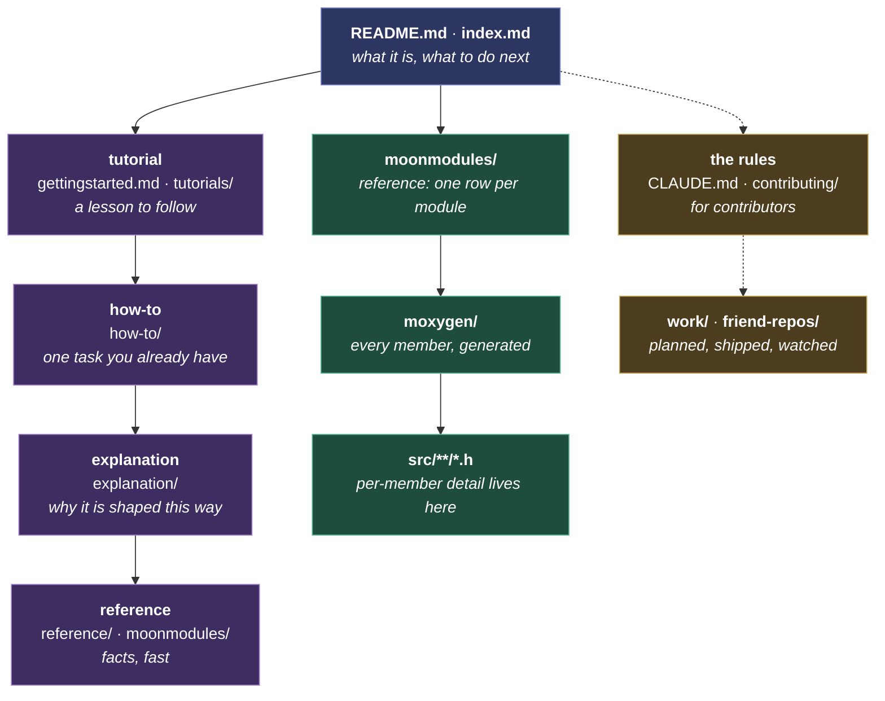

# Documentation standards

How the project writes prose: docs, comments, and the pages generated from them. For developers, the people who write those. Code rules are in [coding-standards.md](coding-standards.md). The two meet at `///` comments, which are code by location and documentation by purpose: their syntax is a coding-standards rule, everything they say follows this page.

Every rule has one home. Another document links here rather than restating, because two copies become two different rules.

It starts with the four kinds of page and which one each of ours is. Then how a page is written, then the two pages every module has. It ends with comments: the smallest scale, and the one place code and prose meet.

## The hierarchy

A reader enters at the top and stops as soon as they have enough. A writer puts a fact at the shallowest level that fully owns it, and links to it from every level above. Purple is the four [Diátaxis](https://diataxis.fr/) types, green is written once in the source and generated from there, and gold sits outside the grid.

Each level says what a thing is and links down for the rest. A fact stated above its home is a second copy that drifts.

The README is the strictest case. It is the page most often written as if it were the only one: it names a capability and links to the page that owns it, so a paragraph of detail there sits in the wrong place.

## What we document

Document a thing once, in the place closest to it, and link the rest. A fact the source states is never re-typed in prose, so the question "where does this belong?" has one answer, and so does "where do I find it?"

Every page serves one of four reader needs, and only one. This is [Diátaxis](https://diataxis.fr/), followed as written: the four come from two questions, whether the reader is **learning** or **working**, and whether they want to **do** something or **understand** it.

| | Doing | Understanding |
|---|---|---|
| **Learning** | **Tutorial**: a lesson to follow. `gettingstarted.md`, `tutorials/`. | **Explanation**: why it is shaped this way. `explanation/`. |
| **Working** | **How-to**: one task you already have. `how-to/`. | **Reference**: facts, fast. `reference/`, the generated technical pages, the catalog rows. |

**The folder under `docs/` is the type.** A page's path says which cell it sits in, so `how-to/building.md` is a how-to by location and a reader never has to be told. The nav labels stay reader-facing ("Understanding projectMM" over "Explanation"), because the type is a writer's tool.

The test for any page is the cell it sits in. A tutorial that stops to explain, or a reference that starts to teach, is two pages: move the other half to where it belongs.

Two kinds of page sit outside the grid on purpose. **The rules** ([CLAUDE.md](../../CLAUDE.md), [coding-standards.md](coding-standards.md), this page) live in `contributing/`, are for contributors, and bind every change. `legal/` sits outside it too. **Work not yet in the code** lives under `docs/work/`, and nothing there describes the system as it is: `future` is what does not exist, `present` is being built and deleted at its PR, `past` is what shipped.

Two scales below a page: **a module** has exactly one reference page written and one generated (see [Module pages](#module-pages)), and **a line of code** carries its own reason in a comment (see [Comments](#comments)).

**The split that decides everything else: a hand-written page says what the code cannot, and a generated page IS the code.** Nobody edits a generated page, because the next build overwrites it. So a fact about behavior belongs in the `.h` and reaches the reader through generation; a fact about intent, cost or sequence has no source to generate from, and is written.

**A shipped plan is a working document, not testimony.** It may be edited, trimmed, or deleted: whatever its PR already carries is duplication. Only a dated record stating what was true at a moment (release notes, an inventory quoted from another project) is kept unrewritten.

## Writing

- **A page is read start to finish by one reader**, either a **user** (no coding, no hardware knowledge beyond plugging in a board) or a **developer** (C++, embedded, this codebase's shape). Where a page serves both, lead with the user and put the depth lower down.
- **The headings are the page's table of contents, and they read top to bottom.** A few lines say what the page is, one paragraph says how it is laid out, then the sections follow in the order a reader needs them. A title that makes sense only after reading the body is the order being wrong.
- **One tone of voice, everywhere: factual, no nonsense.** State what is true and what to do, addressing the reader as "you". Leave out enthusiasm, apology, and how we felt building it. Only the assumed knowledge changes between pages, never the voice.
- **Follow the [principles](../CLAUDE.md#principles).** Three bear on documentation directly:
    - **Minimalism**: every fact has one home; history lives in git.
        - **Present tense only.** "No X anymore" narrates a removal, which is history. Describe the path that exists today.
        - **Positive form only.** "Not", "never", "neither", "without", "un-" and "non-" are the alarm bells: a negation says everything a thing is not, which is no shape at all. A real constraint stays ("the DMA cannot read PSRAM at shift clock"); a bare absence goes.
    - **Industry standards**: the textbook name for a thing, so a reader recognizes it without being taught our vocabulary. A bespoke choice carries its one-line reason where it appears.
    - **Continuous improvement**: a doc describing what the code no longer does is a defect. Fix it in the change that opened the file, not in a sweep.
- **A page links down to detail, it does not absorb it.** Each level says what a thing is and sends the reader to the level that owns the detail. A fact stated above its home is a second copy that drifts. The test: if removing a paragraph costs nothing but a link, it was never this page's to hold. The ladder is in [The hierarchy](#the-hierarchy).
- **A list holds one kind of thing, most important first.** The heading rule, one level down: what a reader reaches for most often leads. A list mixing categories is really two lists.
- **A rule states a test.** Something a reader can hold a page against and get a yes or no. How the rule came to be broken is history, and goes in the commit that fixed it.
- **Say it, then stop: about 40 words.** One or two sentences a reader can act on, and a reason only when the point is surprising or has been got wrong before. Past that a reader skims, and a skimmed statement is not followed.
- **Write for the reader who will follow it**, not the one arguing with it. A trap that only bites whoever maintains the tooling belongs in the tooling.
- **Ask, do not argue.** A request states what you want and why, then stops. Quoting the other side's code back to them and pre-empting every objection is pressure, and earns a reply shorter than the message. Ask the one question that decides the rest.
- **A sentence is one thought.** Past twenty words it is usually two, joined by a comma or a colon that a full stop should have been. Instructions in particular: one step, one sentence, and the reader's eyes never lose the line.
- **The text never refers to itself.** "This page", "this recipe", "as described above", "in the following section": each one is the author stepping in front of the content. Say the thing; the reader knows where they are.
- **A diagram beats the paragraph that describes it.** Draw a structure, a flow or a hierarchy as a [Mermaid](https://mermaid.js.org/) diagram: it renders on the site and on GitHub, and it diffs as text. A screenshot does the same where the point is what a reader sees. Both follow the example rule: they replace prose rather than decorate it.
- **One example, only where the prose alone would be misread.** A code block earns its place by preventing a wrong reading; a second example is the author enjoying the subject.
- **A link's text says what it reaches.** "See the hot path rule" tells the reader whether to follow it; "see here" does not, and a bare filename only if the filename is the point.
- **One parenthetical per sentence.** A second qualification means the sentence carries two ideas: split it, or drop the weaker one.
- **Mechanism lives with the mechanism.** How a generator or script works belongs in that script. A page says what the reader must do.
- **American English spelling, everywhere**: identifiers, wire keys, comments, docs, UI strings. A grep for one dialect silently misses the other, and a drifting wire key breaks a contract with no compile error. A proper noun keeps its own spelling.
- **No em-dashes in prose.** Use a comma, colon, parentheses, or a full stop. A literal one in a UI string or test fixture stays.
- **No hard line wraps in markdown.** Let the editor soft-wrap, so a one-word edit is a one-word diff.
- **Convert as you touch.** Spelling and em-dash fixes ride the change that opens the file, never a repo-wide sweep. `check_prose.py` checks added lines only, for the same reason.

## Module pages

### Two surfaces per module

1. **A summary page**, hand-written, for the end user. One table row in its group's page, carrying the module's description, image, controls, and links. Catalog controls live here because they are runtime `controls_.add(...)` calls that no static tool sees.
2. **A technical page**, generated from the header's `///` comments by [`moondeck/docs/gen_api.py`](../moondeck/docs/gen_api.py).

`docs/moonmodules/` mirrors `src/`: a `core/` and a `light/` subtree, one flat page per group. The tree is `<core|light>/<type>/Module`, flat within a type, and **library is a tag, not a folder level**: in code and assets it rides in `tags()`, in docs it rides in the page name, so `effects.md` splits to `effects_<library>.md` only when a section outgrows it. A blended-lineage module then needs no file move, and a mis-filing is a one-line edit. Generated pages are gitignored and rebuilt. Test inventories have their own generator, [`generate_test_docs.py`](../moondeck/docs/generate_test_docs.py), because unit tests are macros and scenarios are JSON.

**Reference a module generically** outside its own home: say "a modifier", not `FooModifier`. A module's home is its `.h`, its catalog card, its registration, and its tests. Naming it elsewhere multiplies rename cost.

**No per-module detail page.** Cross-file rationale that no single `.h` owns goes in a prose section under its group's summary page. Rationale shared by sibling modules lives once on their base class.

### The card

Two columns. **Module** leads with the image, then the name and description; **Details** carries the controls, then three links below a rule: **Tests**, **API** (the generated page), **Details** (the section below the cards). Those three always show, greyed when there is no target, so their position is learned once. Every other link is prose, made in the sentence that needs it.

Every card leads with an image: `.gif` on effects, modifiers and layouts, which show motion, `.png` elsewhere.

A control reads `` - `name`: what it does ``. The colon separates the name from its description, and the build styles the two differently.

| | Limit |
|---|---|
| Description | 600 characters |
| Controls, together | 600 |
| One control | 120 |
| Details table | 4 columns, 300 characters a cell |

Over a limit the text **moves rather than shrinks**, and its home follows from what it is. Behavior of the module goes in the header's `///`, reaching the reader as the generated page. What a reader needs before choosing between siblings goes in a `## <Name>, details` section below the cards, which the build links from the row. Trimming to fit is the one wrong answer, for the reason [Comments](#comments) gives.

A details section continues the card, so it is written for the same reader. Implementation belongs in the `///`. The heading takes a comma, never an em-dash: the build matches `## <Name>, details` exactly, and [em-dashes are banned](#writing) everywhere.

The card rules are enforced by [`check_docgen.py`](../moondeck/check/check_docgen.py), pinned by [`test_check_docgen.py`](../../test/python/test_check_docgen.py). Where a card begins and ends is the build's own rule, shared: the renderer, `check_docgen` and `check_specs` all ask `split_blocks` rather than each deciding for itself. A check that silently stopped matching would report a clean run, so each rule is tested firing as well as staying quiet.

**Prose is Vale's**, wherever it sits: a page, a `///` block, a comment. One checker for what text says, so a rule has one home and one vocabulary.

## Comments

- **Comments say WHY.** Restating what the line does is noise, and usually a naming failure: see [prefer naming over commenting](coding-standards.md#writing-a-line-of-code).
- **One line, above the code it explains.** A second line is the author still talking. A class `///` gets about ten lines and an `@moreinfo` appendix about twenty; over that, cut. A file whose comments outnumber its code has stopped being a header.
- **Keep the constraint, cut the exposition.** A constraint cannot be recovered from the code: the latch is 300 us, the DMA cannot read PSRAM at shift clock. What was tried first, and why this pattern over another, goes in the commit message.
- **Removing a comment needs the same justification as removing code**: outdated, wrong, or it only restated the code. Never strip to hit a length target, and never delete a reason you cannot reconstruct.
- **Say each fact once.** A restatement for emphasis reads as new information and costs the reader a second pass to learn it is not.
- **A heading inside a comment means it is not a comment.** Needing signposts is the signal to cut. The one exception is `@moreinfo`, whose `##` sections become the generated page's own headings; inside a lead comment a heading wants to be a page, or wants to not exist.
- **MoonLive scripts get three comments, one line each**: what the script is, what each `addControl` knob does, what each function it defines does. Lifecycle functions need none. A script is read in the device's own editor, where prose buries the effect.

### The comment budget

A card is read across a row; a member comment is read beside the thing it describes, and the generated page shows its first sentence as the summary. So the budget is one line, and a deep dive goes after `@moreinfo`.

| | Limit |
|---|---|
| Class `///` | 10 lines |
| `@moreinfo` appendix | 20 lines |
| Any other `///` run | 1 line |
| One comment line, `///` or `//` | 20 words |
| A `//` run beside code | 1 line |
| Every public member | carries one |

The first five cut and the last adds, deliberately: the result is a short line on everything rather than an essay on a few things. The word limit comes from the tree, where a member line is 14 words at the median and 19 at p95, so it bites the outliers and leaves the normal case alone.

**Use `//` sparingly.** A comment restating what the code does is a naming failure, and the fix is a better name rather than a better sentence. What survives is the WHY a reader cannot recover from the code.

**`//` carries the same one-line budget as `///`, and that is what makes the `///` cap mean anything.** Without it the one-line rule moves text rather than removing it: a fifty-line member comment re-spelled as `//` satisfies every other rule and leaves the file exactly as long. One line is room to say why; past that the reasoning belongs after `@moreinfo`, or on the module's page where a reader will find it. The `//` block above the first class is exempt, being the non-Doxygen sibling of the class comment.

Enforced by [`check_docgen.py`](../moondeck/check/check_docgen.py), which names the areas it covers.

### Writing a `///` that generates correctly

These are traps, not style: each one silently loses content from the generated page.

- **`///`, not `//`.** Only `///` generates. A `//` comment is invisible on the technical page.
- **The class `///` sits directly above `class X`**, inside the namespace. Separated by includes or the namespace open, Doxygen drops it and the page loses its description.
- **Put detail on the member it describes**, not in the class comment. Every public control and method gets its own `///` leading with one sentence, which is what the generated page shows as its summary.
- **Deep dives go after `@moreinfo`** at the end of the class block, and a post-process moves them below the member lists. The budget above applies: this is not an unbounded appendix.
- **No relative `.md` links.** Doxygen keeps only `http(s)://` links. For an in-page link use `@xref{anchor|label}`.
- **Wrap any `<tag>` in backticks**, or it renders as a live element and swallows the page.
- **Write "such as", not "e.g."** The brief ends at the first period.
- **A weasel that CONTRASTS is information.** "bytes actually allocated" against requested, "the factor actually in use" against configured: the word carries the distinction the comment exists to draw. Vale flags the word rather than the use, which is why its Weasel rule is a suggestion.
- **A `"\u2014"` string literal is not prose.** The dash a control shows for an unset value is UI text: converting it changes what the device displays. Vale flags it, and it stays.
- **`@xref`, `@card` and `@moreinfo` are ours, and Doxygen must not know them.** Each survives as plain text precisely because it is not a Doxygen command, and a post-process turns it into a link, an image or a section afterward. Declaring them as `ALIASES` makes Doxygen consume them and the post-process finds nothing left: every card image, cross-reference and More info section goes. This is also why the marker is `@xref` rather than `@ref`, which Doxygen does own.
- **Doxygen's own warnings stay off.** `WARN_IF_DOC_ERROR` reports only the three commands above, so on this codebase it is noise by construction rather than a signal being silenced.
