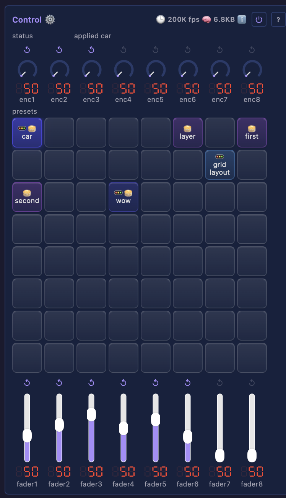

# Core control

The device's control surface — the place that says "put the device into this state", whatever asked for it. A preset applied from the grid, and later a fader moved on a MIDI desk, arrive at the same code. Its first capability is presets; the surface layout exists so external controllers map onto something that already looks like them.

`ControlModule` is a top-level module, a peer of Layouts / Layers / Drivers rather than a child of Services: it reaches *across* the top-level modules, so it cannot sit inside one.

## Control modules

<a id="control"></a>

### Control

A grid of preset pads, a row of rotary encoders above them, and a bank of faders below — the layout of a Mackie-style control desk ([X-Touch](https://www.behringer.com/product.html?modelCode=0808-AAF), [QCon Pro G2](https://www.iconproaudio.com/product/qcon-pro-g2/)), so a physical surface maps onto it without a translation layer.



- `presets` — the pad grid (8×8). One pad per preset file; click to apply, right-click (or long-press) to name, choose what it captures, save or delete. Drag a pad to rearrange the surface.
- `enc1` … `enc8` — rotary encoders. Drag or scroll to turn; right-click shows what each drives.
- `fader1` … `fader8` — faders. `fader1` drives `Drivers.brightness`; the rest are unassigned until bound.

Detail: [technical](moxygen/ControlModule.md)

[Tests](../../tests/unit-tests.md#controlmodule)

## Presets

A preset is a file: `/.config/presets/<name>.json`. Saving writes one, applying reads one, deleting removes one. A preset uploaded through the File Manager appears on the grid; nothing else holds preset state, so there is no second copy to keep in step, and the list is rebuilt from the folder at startup rather than persisted alongside it.

The name becomes the file name, so it is restricted to printable ASCII without `/`, `\` or `.` — a validator on the control, which every write path runs. `slot` records which pad the preset occupies, so a surface arranged to match a physical desk survives a reboot.

### What a preset carries

A preset captures a **selectable set** of top-level subtrees, recorded in the file:

```json
{
  "slot": 12,
  "captures": "Layouts,Layers",
  "Layouts.enabled": true, "Layouts.0.type": "GridLayout", "Layouts.0.width": 128,
  "Layers.enabled":  true, "Layers.0.type":  "Layer",      "Layers.0.0.type": "NoiseEffect"
}
```

Each captured subtree is exactly the bytes the persistence engine already writes for that module, namespaced under a `<TypeName>.` key prefix. Save and restore therefore reuse the engine that reconciles a tree against JSON ([`saveSubtreeTo` / `applySubtree`](moxygen/FilesystemModule.md)) rather than a second serializer that could drift from it.

The capture set decides what a preset means. `Layers` alone is a look, and applies to a board with different hardware. Adding `Drivers` makes it a device snapshot that carries pin maps. Because the file records the set, applying a preset is never a surprise.

A capture naming a module this build does not have is skipped and reported in the status line, and an unknown module type inside a capture is skipped while the rest still applies — the same degrade-never-crash rule the boot loader follows. A malformed file leaves the live tree untouched.

### One active preset per role

Each capturable subtree holds a **role**: layout, layer, driver, service. Applying a preset claims every role it carries and leaves the others alone, so a layout preset and a layer preset are both active at once, and applying a new layer preset replaces only the layer.

A pad is tinted by its roles (layout blue, layer violet, driver green, service amber), mixing the hues when it carries several. A lit pad shows the roles it still *holds*: a preset whose layer has since been replaced but whose layout is still applied stays lit in the layout color.

This is why mixed presets need no special case. A mixed preset owns several roles rather than being a different kind of pad, and the same rule colors it and decides when it is superseded.

### Applying is a rebuild

Applying a preset creates, replaces and destroys modules to match what the file describes — it is a restore, not a value overlay: a preset carrying more than the device has adds it, and one describing less removes what it omits.

Structural mutation quiesces the render worker, and mutations run inline on the render tick, so a large restore stalls rendering for its duration. Every captured subtree is applied first and `prepareTree()` runs once at the end, rather than once per capture. Presets are a cold-path feature; the tick path is untouched.
