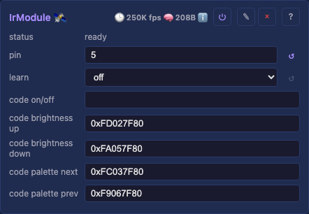

# Core services

The user-added **Service** modules — capability bridges the device provides or consumes, added and removed at runtime in the `Services` container (the core-domain twin of the light domain's `Effects`/`Drivers`). Fixed device infrastructure (identity, network, inspection tools) lives under **System** — see [core/system.md](system.md). Every row links to its generated technical page (the full API, from the `.h`) and its tests.

## Services

The top-level container the Service modules hang under — a grouping node with no controls of its own, the same shape as `Effects`/`Drivers` in the light domain. Adds/removes its children (Audio, IR) at runtime via the generic module machinery.

Detail: [technical](moxygen/Services.md)

### Audio

A Service (added by the user, not auto-wired): the audio source that feeds the FFT audio-reactive effects consume via `AudioService::latestFrame()`. `mode` is the first choice, the module's identity, and each mode shows only its own detail controls: Local audio runs its own input (an I²S microphone or line-in ADC on boards; an OS capture device on desktop) and analyzes it locally, Receive network is a pure network sink a peer's WLED-compatible audio drives, and Simulate is a synthesized source for demos and tests. On I²S targets Local mode idles until real GPIOs are entered; on desktop it captures the picked device right away. A desktop in Local mode with `send audio` on is a WLED audio-sync source: one machine's microphone or loopback drives a whole fleet of boards in Receive mode. The Receive network mode and every network-sync control (`send audio`, `syncPort`, `sync status`) exist only on network-capable targets (`platform::hasNetwork`); a no-network build offers a two-option picker: Local audio and Simulate.

- `mode` — Local audio / Receive network / Simulate: analyze the on-board mic/line-in, consume a peer's audio off the network (WLED-compatible), or feed a synthesized signal. Receive network appears only on a network build; the controls below are its detail, shown per mode.
- `sckPin` / `wsPin` / `sdPin`: (Local, I²S targets) the I²S GPIOs (bit clock / word-select / data; unset until entered).
- `mclkPin`: (Local, I²S targets) master-clock GPIO for a line-in ADC that needs one (e.g. the PCM1808); leave unset for a plain mic.
- `device`: (Local, desktop) the OS capture input: `default` follows the system setting; loopback devices appear when present, so effects can follow what the machine plays. Picked by list position: if the OS reorders devices, re-pick (`default` is order-stable).

  **Capturing what the machine plays (loopback), per OS.** macOS has no native loopback: install [BlackHole](https://existential.audio/blackhole/), create a **Multi-Output Device** in Audio MIDI Setup (tick your speakers/DAC first plus BlackHole, enable drift correction on BlackHole) and set it as the system output; the speakers keep playing while an identical copy lands in BlackHole, which this control captures. The Mac's volume keys go dead on a multi-output device: set volume in the player or on the DAC. Windows usually needs nothing: enable **Stereo Mix** (Sound settings, Recording tab) and pick it here; it taps the output while the speakers keep playing (VB-Cable is the fallback where a driver lacks Stereo Mix). Linux PulseAudio/PipeWire expose a **Monitor of <output>** source natively; just pick it.
- `sampleRate` — (Local) mic/ADC sample rate.
- `floor` / `gain`: (Local) noise floor and input gain for the analysis. The default gain suits a quiet MEMS mic; a loopback device delivers near-full-scale digital audio, so turn `gain` down hard (single digits) or everything clips to maximum.
- `send audio` — (Local, network build) broadcast the local analysis as WLED audio-sync packets for the WLED ecosystem.
- `simulate` — (Simulate) the synthetic pattern: `music` (a plausible song) or `sweep` (a deterministic band-marching test pattern).
- `syncPort` — (network build) the UDP port (default 11988, the WLED standard), shown when sending or receiving; set it the same on both ends. `sync status` reports the live send/receive state.
- read-only — `level` (RMS), `peakHz` (the audio driving effects, from any source).

Prior art: the WLED-MM audio-reactive usermod by **Frank ([@softhack007](https://github.com/softhack007))**, the most-used open-source audio-reactive LED implementation, whose adaptive noise-gate concept the analysis here descends from (analysed with his permission); and **[@troyhacks](https://github.com/troyhacks/WLED)**, who reworked that DSP onto Espressif's [esp-dsp](https://github.com/espressif/esp-dsp) FFT, the same choice this service makes. The line-in path exists because **wladi ([myhome-control](https://shop.myhome-control.de))** supplied the hardware and pinout for the [MHC-WLED ESP32-P4 shield](../../reference/mhc-wled-esp32-p4-shield.md): its onboard PCM1808 I2S ADC is what `mclkPin` is for.

Detail: [technical](moxygen/AudioService.md)

[Tests](../../tests/unit-tests.md#audioservice)

### IR

A Service (added per board): an IR remote receiver that drives other modules' controls through the shared `Scheduler::setControl` primitive. It **learns** any remote (NEC-over-RMT): pick an action in `learn`, press a button to bind its code. What each action does + the status-line messages: ⌄ details.

- `pin` — the IR receiver GPIO (unset until entered; on the SE16 it shares GPIO 5 with the Ethernet MISO via the board switch, on the LightCrafter it is its own GPIO 4 alongside Ethernet).
- `learn` — pick an action to bind (`on/off` / brightness up / brightness down / palette next / palette prev); the next received code binds to it, then learning disarms. The first option, `off`, is the disarmed state (bind nothing), not a light action.
- `code on/off` / `code brightness up` / `code brightness down` / `code palette next` / `code palette prev` — read-only, the learned code for each action (persisted).

Detail: [technical](moxygen/IrService.md)

## IR — details

The learned actions drive the `Drivers` module: `on/off` toggles `Drivers.on` (master power), brightness up/down nudge `Drivers.brightness` (±16, clamped 0–255), and palette next/prev step `Drivers.palette`.

The status line reports setup state ("set pin to receive" / "ready"), the learn prompt, a binding ("learned … = 0x…"), a fired action ("Drivers.brightness → N", "Drivers.on → off"), and an unbound code ("received 0x… (unassigned)").
