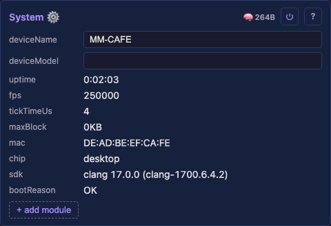
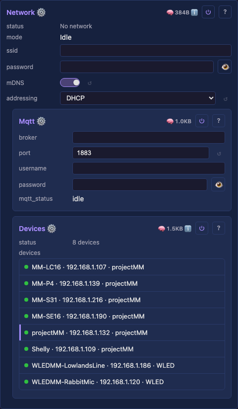
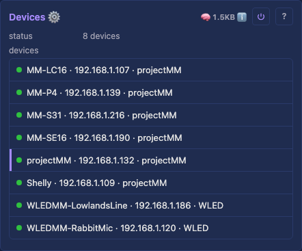
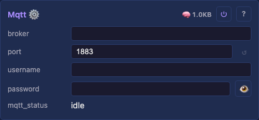
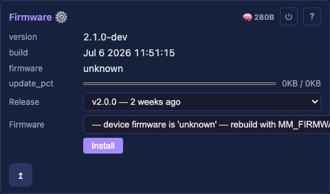
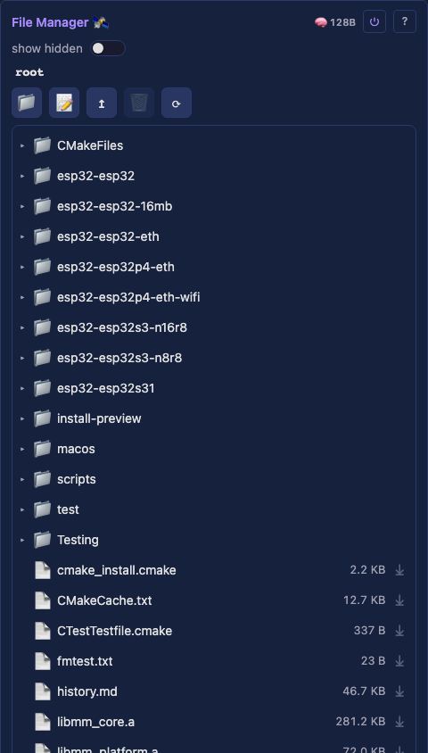
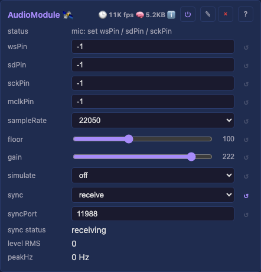
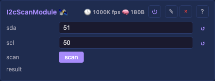

# Core services

The user-facing core services — the machinery that runs a show, each configurable in the web UI. Every row links to its generated technical page (the full API, from the `.h`) and its tests. Cross-cutting rationale that no single `.h` owns lives in the prose sections below the table.

<a id="system"></a>

### System

The device's identity and vitals — name (behind mDNS `<name>.local`, the SoftAP SSID, the DHCP hostname), uptime, heap, and per-module footprint reporting. Hosts the Audio and I2C-scan peripherals.



- `deviceName` — the device identity behind mDNS `<name>.local`, the SoftAP SSID, and the DHCP hostname.
- `deviceModel` — the board model (drives the installer catalog entry).
- read-only vitals — `uptime`, `fps`, `heap`, `psram`, `flash`, `chip`, and per-module footprint.

Detail: [technical](../moxygen/SystemModule.md)

[Tests](../../../tests/unit-tests.md#systemmodule)

<a id="network"></a>

### Network

WiFi / Ethernet connectivity, static-IP configuration, RSSI and TX-power reporting. Brings the device onto the LAN before the HTTP and WebSocket servers start.



- `mode` — WiFi / Ethernet / off.
- `ssid` / `password` — WiFi credentials.
- `mDNS` — the `<name>.local` hostname.
- `addressing` — DHCP or static; static exposes IP / gateway / subnet / DNS fields.
- `ethType` / `ethPhyAddr` / `ethRstGpio` / … — Ethernet PHY configuration.
- read-only — `rssi` (dBm), `txPower` (dBm).

Detail: [technical](../moxygen/NetworkModule.md)

[Tests](../../../tests/unit-tests.md#networkmodule)

<a id="improv-provisioning"></a>

### Improv provisioning

Serial/BLE Improv Wi-Fi provisioning — the web installer hands credentials to a fresh device over this protocol during the flash-and-connect flow.


- `provision_status` — read-only provisioning state.

Detail: [technical](../moxygen/ImprovProvisioningModule.md)

<a id="devices"></a>

### Devices

Discovers and lists other projectMM devices on the LAN (the `devices` List control), each row expanding to a detail panel; persists the last-known list across reboot.



- `devices` — a List control of discovered devices; each row expands to a detail panel. Persistable.

Detail: [technical](../moxygen/DevicesModule.md)

[Tests](../../../tests/unit-tests.md#devicesmodule)

<a id="mqtt"></a>

### MQTT

Bridges the light to an MQTT broker so a home-automation hub (Homebridge) can control it — a transport over the shared `Scheduler::setControl` apply-core, not new control logic. Our own dependency-free MQTT 3.1.1 client; disabled until a broker is set. Topics, colour-wheel mapping, and the Homebridge config: ⌄ details.



- `broker` — the broker hostname (e.g. `homeassistant.lan`) or IP. A hostname is resolved via DNS.
- `port` — broker port (default 1883).
- `username` / `password` — broker credentials (optional; the password is stored obfuscated like the WiFi password).
- read-only — `mqtt_status` (`disabled` / `idle` / `connecting` / `connected` / `disconnected` / an error).

Detail: [technical](../moxygen/MqttModule.md)

[Tests](../../../tests/unit-tests.md#mqttmodule)

<a id="firmware-update"></a>

### Firmware update

Over-the-air firmware flashing — the one operation that swaps the binary and needs a power cycle (every *config* change applies live; a firmware OTA does not).



- `firmware` — the OTA image to flash.
- read-only — `version`, `build`, `firmwarePartition`, `update_pct` (progress).

Detail: [technical](../moxygen/FirmwareUpdateModule.md)

[Tests](../../../tests/unit-tests.md#firmwareupdatemodule)

<a id="file-manager"></a>

### File Manager

A boot-wired system tool (distinct from Filesystem, the persistence *engine*): browse and manage the device filesystem from a dedicated panel — a lazy expand/collapse folder tree (VS Code / Explorer shape) plus an inline text editor. Browsing is UI-side over `/api/dir` + `/api/file`, so the module itself stays minimal. Tree/toolbar/editor behaviour: ⌄ details.



- `file browser` — the panel itself: an expand/collapse folder tree with a toolbar (＋folder / ＋file / delete / refresh / upload) and an inline text editor. The module's main surface (⌄ details for the interactions).
- `show hidden` — reveal dot-prefixed files/folders (e.g. `.config`); forwarded to `/api/dir` as its `hidden` filter.
- `filesystem` — read-only usage bar (used / total bytes, from the platform).
- `lastSaved` — read-only; how long ago config was persisted (read from the Filesystem engine).

Detail: [technical](../moxygen/FileManagerModule.md)

<a id="audio"></a>

### Audio

A System peripheral (added by the user, not auto-wired): an I²S microphone (or line-in ADC) feeding the FFT that audio-reactive effects consume via `AudioModule::latestFrame()`. It also syncs audio over UDP, WLED-compatible: broadcast the local analysis for the WLED ecosystem, or receive a peer's audio to drive effects with no local mic. Idle until real GPIOs are entered.



- `wsPin` / `sdPin` / `sckPin` — the I²S GPIOs (unset until entered).
- `mclkPin` — master-clock GPIO for a line-in ADC that needs one (e.g. the PCM1808); leave unset for a plain mic.
- `sampleRate` — mic/ADC sample rate.
- `floor` / `gain` — noise floor and input gain for the analysis.
- `simulate` — feed a synthetic signal instead of the mic (for testing without hardware).
- `sync` — Off / Send / Receive: broadcast or receive WLED audio-sync packets. `syncPort` sets the UDP port (default 11988, the WLED standard); Receive auto-blends back to the local mic ~1 s after a peer goes quiet.
- read-only — `level` (RMS), `peakHz`, `sync status`.

Detail: [technical](../moxygen/AudioModule.md)

[Tests](../../../tests/unit-tests.md#audiomodule)

<a id="i2c-scan"></a>

### I2C scan

A System peripheral that probes the I²C bus (default GPIO21/22) on a button press and reports the addresses found.



- `sda` / `scl` — the bus GPIOs (default GPIO21/22).
- `scan` — a button; press to probe the bus now.
- read-only — `result` (addresses found).

Detail: [technical](../moxygen/I2cScanModule.md)

<a id="ir"></a>

### IR

A System peripheral (added per board): an IR remote receiver that drives other modules' controls through the shared `Scheduler::setControl` primitive. It **learns** any remote (NEC-over-RMT): pick an action in `learn`, press a button to bind its code. What each action does + the status-line messages: ⌄ details.


- `pin` — the IR receiver GPIO (unset until entered; on the SE16 it shares GPIO 5 with the Ethernet MISO via the board switch, on the LightCrafter it is its own GPIO 4 alongside Ethernet).
- `learn` — pick an action to bind (`on/off` / brightness up / brightness down / palette next / palette prev); the next received code binds to it, then learning disarms. The first option, `off`, is the disarmed state (bind nothing), not a light action.
- `code on/off` / `code brightness up` / `code brightness down` / `code palette next` / `code palette prev` — read-only, the learned code for each action (persisted).

Detail: [technical](../moxygen/IrModule.md)

## MQTT — details

The topic prefix is `projectMM/<mac>` — a **stable** identifier (the last 6 hex of the device's MAC), fixed for the device's life. Renaming the device does **not** change its topics, so a hub's config never breaks on a rename (the WLED/Tasmota/Home-Assistant convention). It's derived, not a stored control.

**Topics** (for a device whose MAC ends `563cfe`): the device SUBSCRIBEs to the `set` topics and PUBLISHes the `get` topics on change (and on connect, so a controller never reads "No Response"). It also publishes its friendly `deviceName` on the retained `name` topic, so a hub can show the human name while the topics stay MAC-stable:

| direction | topic | payload |
|---|---|---|
| set → device | `projectMM/563cfe/on/set` | `true` / `false` |
| device → get | `projectMM/563cfe/on/get` | `true` / `false` |
| set → device | `projectMM/563cfe/brightness/set` | `0`–`100` |
| device → get | `projectMM/563cfe/brightness/get` | `0`–`100` |
| set → device | `projectMM/563cfe/hsv/set` | `h,s,v` (hue `0`–`359`, sat/val `0`–`100`) |
| device → get | `projectMM/563cfe/hsv/get` | `h,s,v` |
| device → get | `projectMM/563cfe/name` | the friendly `deviceName` (retained) |

The HomeKit colour wheel has no "palette" concept, so `hsv/set`'s hue+saturation pick the **nearest palette** (each built-in palette has a representative colour; the closest one is selected) and the value drives brightness — the colour wheel becomes a natural palette selector.

**Homebridge** — install [`homebridge-mqttthing`](https://github.com/arachnetech/homebridge-mqttthing) and add a `lightbulb` accessory. Use the device's own MAC suffix (read it from the `mqtt_status`/topics, or `mosquitto_sub -t 'projectMM/#'`) in place of `563cfe`:

```json
{
  "accessory": "mqttthing",
  "type": "lightbulb",
  "name": "projectMM",
  "url": "mqtt://<broker>:1883",
  "username": "<user>",
  "password": "<pass>",
  "topics": {
    "getOn": "projectMM/563cfe/on/get",
    "setOn": "projectMM/563cfe/on/set",
    "getBrightness": "projectMM/563cfe/brightness/get",
    "setBrightness": "projectMM/563cfe/brightness/set",
    "getHSV": "projectMM/563cfe/hsv/get",
    "setHSV": "projectMM/563cfe/hsv/set"
  },
  "onValue": "true",
  "offValue": "false"
}
```

Home Assistant does not need MQTT: it adopts the device through its built-in WLED integration over the existing WLED `/json` API.

## File Manager — details

The panel is a lazy folder **tree** (each folder loads its children on first expand) plus an inline text editor. Dot-prefixed entries (the `.config` persistence dir) are hidden unless `show hidden` is on.

- Click a folder's row to select it and toggle its expansion (▸/▾); click a selected file to open the editor.
- The toolbar acts on the selected node: **＋ folder** creates a folder inside it, **＋ file** creates an empty file (click it to edit), **🗑 delete** removes the selected file or empty folder (press-twice to confirm), **⟳** refreshes.
- **Drag files from the desktop** onto a folder (or the tree) to upload them — the body streams straight to the file (any size, binary-safe; capped only by a sanity limit and the free space, which it reports if short); a per-file **⤓** streams it back to the desktop.
- The editor loads a file's text, pretty-prints JSON on open, and saves atomically; a binary file (contains a NUL) loads read-only (use ⤓ to fetch it intact). Upload and download both stream, so neither truncates.
- Create / delete are HTTP calls (`POST` / `DELETE /api/dir?path=`), not controls — the path rides the request, so nothing is stored on the device per op.

Last-modified dates (needs an NTP time source + LittleFS mtime), binary/large + folder upload, folder-as-zip download, and `.ml` syntax highlighting are backlogged ([backlog-core § File Manager follow-ups](../../../backlog/backlog-core.md#file-manager-follow-ups)).

## IR — details

The learned actions drive the `Drivers` module: `on/off` toggles `Drivers.on` (master power), brightness up/down nudge `Drivers.brightness` (±16, clamped 0–255), and palette next/prev step `Drivers.palette`.

The status line reports setup state ("set pin to receive" / "ready"), the learn prompt, a binding ("learned … = 0x…"), a fired action ("Drivers.brightness → N", "Drivers.on → off"), and an unbound code ("received 0x… (unassigned)").
