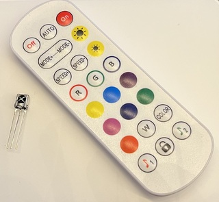

# Core UI modules

The user-facing core services — the machinery that runs a show, each configurable in the web UI. Every row links to its generated technical page (the full API, from the `.h`) and its tests. Cross-cutting rationale that no single `.h` owns lives in the prose sections below the table.

### System

The device's identity and vitals — name (behind mDNS `<name>.local`, the SoftAP SSID, the DHCP hostname), uptime, heap, and per-module footprint reporting. Hosts the Audio and I2C-scan peripherals.

- `deviceName` — the device identity behind mDNS `<name>.local`, the SoftAP SSID, and the DHCP hostname.
- `deviceModel` — the board model (drives the installer catalog entry).
- read-only vitals — `uptime`, `fps`, `heap`, `psram`, `flash`, `chip`, and per-module footprint.

Detail: [technical](../moxygen/SystemModule.md)

[Tests](../../../tests/unit-tests.md#systemmodule)

### Network

WiFi / Ethernet connectivity, static-IP configuration, RSSI and TX-power reporting. Brings the device onto the LAN before the HTTP and WebSocket servers start.

- `mode` — WiFi / Ethernet / off.
- `ssid` / `password` — WiFi credentials.
- `mDNS` — the `<name>.local` hostname.
- `addressing` — DHCP or static; static exposes IP / gateway / subnet / DNS fields.
- `ethType` / `ethPhyAddr` / `ethRstGpio` / … — Ethernet PHY configuration.
- read-only — `rssi` (dBm), `txPower` (dBm).

Detail: [technical](../moxygen/NetworkModule.md)

[Tests](../../../tests/unit-tests.md#networkmodule)

### Improv provisioning

Serial/BLE Improv Wi-Fi provisioning — the web installer hands credentials to a fresh device over this protocol during the flash-and-connect flow.

- `provision_status` — read-only provisioning state.

Detail: [technical](../moxygen/ImprovProvisioningModule.md)

### Devices

Discovers and lists other projectMM devices on the LAN (the `devices` List control), each row expanding to a detail panel; persists the last-known list across reboot.

- `devices` — a List control of discovered devices; each row expands to a detail panel. Persistable.

Detail: [technical](../moxygen/DevicesModule.md)

[Tests](../../../tests/unit-tests.md#devicesmodule)

### Firmware update

Over-the-air firmware flashing — the one operation that swaps the binary and needs a power cycle (every *config* change applies live; a firmware OTA does not).

- `firmware` — the OTA image to flash.
- read-only — `version`, `build`, `firmwarePartition`, `update_pct` (progress).

Detail: [technical](../moxygen/FirmwareUpdateModule.md)

[Tests](../../../tests/unit-tests.md#firmwareupdatemodule)

### Filesystem

Persists control values as JSON and restores them on boot, overlaying loaded values through each control's pointer during `onBuildControls()`. The home of the no-reboot live-reconfiguration behaviour.

- read-only — `lastSaved`.

Detail: [technical](../moxygen/FilesystemModule.md)

[Tests](../../../tests/unit-tests.md#filesystemmodule)

### File Manager

A boot-wired system tool (distinct from Filesystem, which is the persistence *engine*): browse and manage the device filesystem. It renders a dedicated panel — a lazy expand/collapse folder **tree** (the standard VS Code / Explorer shape: each folder loads its children on first expand) plus an inline text editor. Browsing is UI-side over the `/api/dir` listing endpoint; file contents come over `/api/file`; so the module itself stays minimal, exposing only the operations. Dot-prefixed entries (the `.config` persistence dir) are hidden unless `show hidden` is on.

- `show hidden` — reveal dot-prefixed files/folders (e.g. `.config`); forwarded to `/api/dir` as its `hidden` filter.
- Click a folder's row to select it and toggle its expansion (▸/▾); click a selected file to open the editor.
- The toolbar acts on the selected node: **＋ folder** creates a folder inside it, **＋ file** creates an empty file (click it to edit), **🗑 delete** removes the selected file or empty folder (press-twice to confirm), **⟳** refreshes.
- **Drag files from the desktop** onto a folder (or the tree) to upload them — the body streams straight to the file (any size, binary-safe; capped only by a sanity limit and the free space, which it reports if short); a per-file **⤓** streams it back to the desktop.
- The editor loads a file's text, pretty-prints JSON on open, and saves atomically; a binary file (contains a NUL) loads read-only (use ⤓ to fetch it intact). Upload and download both stream, so neither truncates.
- A filesystem-usage bar (used / total, read from the platform) sits below the tree.
- `path` — the absolute op target the tree sets (mkdir / delete); not user-typed.

Last-modified dates (needs an NTP time source + LittleFS mtime), binary/large + folder upload, folder-as-zip download, and `.ml` syntax highlighting are backlogged ([backlog-core § File Manager follow-ups](../../../backlog/backlog-core.md#file-manager-follow-ups)).

Detail: [technical](../moxygen/FileManagerModule.md)

### Audio

A System peripheral (added by the user, not auto-wired): an I²S microphone (or line-in ADC) feeding the FFT that audio-reactive effects consume via `AudioModule::latestFrame()`. It also syncs audio over UDP, WLED-compatible: broadcast the local analysis for the WLED ecosystem, or receive a peer's audio to drive effects with no local mic. Idle until real GPIOs are entered.

- `wsPin` / `sdPin` / `sckPin` — the I²S GPIOs (unset until entered).
- `mclkPin` — master-clock GPIO for a line-in ADC that needs one (e.g. the PCM1808); leave unset for a plain mic.
- `sampleRate` — mic/ADC sample rate.
- `floor` / `gain` — noise floor and input gain for the analysis.
- `simulate` — feed a synthetic signal instead of the mic (for testing without hardware).
- `sync` — Off / Send / Receive: broadcast or receive WLED audio-sync packets. `syncPort` sets the UDP port (default 11988, the WLED standard); Receive auto-blends back to the local mic ~1 s after a peer goes quiet.
- read-only — `level` (RMS), `peakHz`, `sync status`.

Detail: [technical](../moxygen/AudioModule.md)

[Tests](../../../tests/unit-tests.md#audiomodule)

### I2C scan

A System peripheral that probes the I²C bus (default GPIO21/22) on a button press and reports the addresses found.

- `sda` / `scl` — the bus GPIOs (default GPIO21/22).
- `scan` — a button; press to probe the bus now.
- read-only — `result` (addresses found).

Detail: [technical](../moxygen/I2cScanModule.md)

### IR

A System peripheral (added per board, not auto-wired): an IR remote receiver that drives other modules' controls through the shared `Scheduler::setControl` primitive — the device's IR input, the counterpart of the WLED-app bridge. It **learns** any remote: pick an action in `learn`, press a remote button to bind its code, and thereafter that button drives the action. Decoding is real NEC-over-RMT; a received code (bound or not) shows in the status line.

- `pin` — the IR receiver GPIO (unset until entered; on the SE16 it shares GPIO 5 with the Ethernet MISO via the board switch, on the LightCrafter it is its own GPIO 4 alongside Ethernet).
- `learn` — pick an action (off / brightness up / brightness down / palette next / palette prev); the next received code binds to it, then learning disarms.
- `code brightness up` / `code brightness down` / `code palette next` / `code palette prev` — read-only, the learned code for each action (persisted).

The actions nudge `Drivers.brightness` (±16, clamped 0–255) and step `Drivers.palette` (next/previous). The status line reports setup state ("set pin to receive" / "ready"), the learn prompt, a binding ("learned … = 0x…"), a fired action ("Drivers.brightness → N"), and an unbound code ("received 0x… (unassigned)").

Detail: [technical](../moxygen/IrModule.md)
