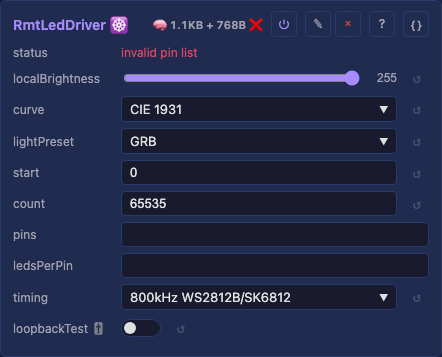
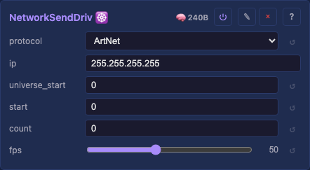
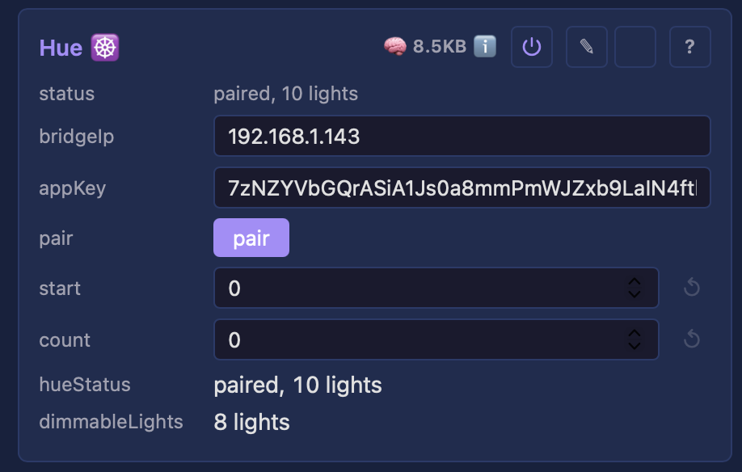
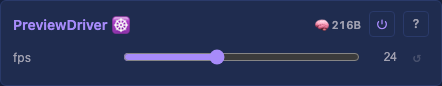

# Drivers

A driver reads its window of the [Drivers](moxygen/Drivers.md) container's shared buffer, applies its per-light [output correction](moxygen/DriverBase.md), and sends the result out — a wire protocol (WS2812), the network (Art-Net / E1.31 / DDP), a smart-light hub (Hue), or the web UI (Preview). Drivers are added per board through the catalog ([`deviceModels.json`](../../../web-installer/deviceModels.json)); `PreviewDriver` is the one boot-wired driver. Every driver leads with the same [shared correction + source-window controls](#shared-driver-controls) (`localBrightness` / `preset` / `whiteMode` and the `start` / `count` slice `[start, start+count)`), then its own. Each card links to a detail page and, where it doesn't fit the table, a **⌄ details** section below.

**Jump to:** [shared controls](#shared-driver-controls) · [LED output](#led-output-drivers) · [Network](#network-drivers) · [Smart light](#smart-light-drivers) · [Preview](#preview-drivers)

## Shared driver controls

Every driver card leads with the same block, added once by [`DriverBase`](moxygen/DriverBase.md) so no driver re-implements it: a per-driver **output correction** (how this driver's slice looks) and a **source window** (which slice of the shared buffer it reads). The driver's own controls (pins, protocol, IP…) follow.

- `localBrightness` — this driver's dim (0–255), multiplied with the global brightness into one LUT; both sliders reach the output.
- `preset` — the [light preset](supporting.md) this driver applies per light (channel order / RGBW synthesis), referenced by its stable id (not its name), so renaming or reordering presets never breaks a driver's reference and it survives a reboot.
- `whiteMode` — how the white channel is derived for an RGBW strip, applied only when the referenced preset carries a W channel.
- `start` — first light of the shared buffer this driver reads (default `0`).
- `count` — how many lights from `start` this driver drives. **Blank / default drives all lights** (the value is the `uint16` max, clamped to the buffer); set a number to output only that slice — the way multiple drivers each own a section of one buffer (an onboard status LED at `0`, the main strip from `1`).

## LED output drivers

### LED output 💫 · wire

Addressable WS2812B-class LEDs over a wire, one GPIO per strand. Three peripherals do this — pick by chip: **RMT** (single/few strands, any ESP32), **MultiPin** (8 or 16 parallel strands — the i80 bus, backed by LCD_CAM on the S3/P4 and by the I2S peripheral on the classic ESP32), **Parlio** (1–16 parallel strands, P4). Same controls, same wire contract; they differ only in how many strands clock out at once and on which chip.

**Moon** is a fourth entry: the *same* LCD_CAM output as **MultiPin**, same pins and same controls, but driven by our own DMA code instead of ESP-IDF's `esp_lcd`. It exists to lift the memory ceiling that caps how many lights the MultiPin driver can drive. **MultiPin remains the default and the reference implementation**; Moon is the challenger, and both are offered so they can be compared on the same board without a reflash. Why, and what it costs: [ADR-0014](../../adr/0014-own-i80-dma-driver-below-esp-lcd.md).

Plus the [shared correction + window controls](#shared-driver-controls) above:

- `pins` — data GPIO list, e.g. `18,17,16` (one strand each). Empty idles until set; changing it re-inits live.
- `ledsPerPin` — lights per pin, following the broadcasting idiom (cf. NumPy / CSS shorthand): **empty** = even split of the window across pins; **one number** = that many on *every* pin (`64` → 64 each); **a list** `3,4,5` = one per pin by position (a short list even-splits the remainder). Shorter lanes idle for the extra pixel-clocks (padded to the longest).
- `loopbackTest` — on/off TX→RX loopback self-test (jumper the first pin to `loopbackRxPin`); verdict in the status field.
- `loopbackTxPin` / `loopbackRxPin` — optional TX override + the RX pin for the self-test. Shown only while `loopbackTest` is on.

Origin: WS2812B on FastLED / hpwit / WLED prior art ([analysis](../../backlog/leddriver-analysis-top-down.md))

[Tests](../../tests/unit-tests.md#rmtleddriver)

Detail: [RMT](moxygen/RmtLedDriver.md) · [MultiPin](moxygen/MultiPinLedDriver.md) · [Moon](moxygen/MoonLedDriver.md) · [Parlio](moxygen/ParlioLedDriver.md)

## Network drivers

### Network Send 💫 · UDP

Streams the buffer over UDP as **Art-Net**, **E1.31 / sACN**, or **DDP** — one burst per frame, compatible with Falcon/Advatek controllers, xLights, and LedFx. Feeds **one or more receivers** from a single driver: each gets its own slice of the window, unicast to its own address.

- `protocol` — Art-Net / E1.31 / DDP (default Art-Net); the destination port follows automatically.
- `ips` — the receivers. **Blank by default — the driver idles until set**, so it never sends uninvited traffic. Type the full address once, then a range or a list: `192.168.1.70-74` (five tubes, ends inclusive) or `192.168.1.60,61,62,65`; both mix, and a further full address switches subnet.
- `lightsPerIp` — lights per receiver, same idiom as an LED driver's `ledsPerPin`: **blank** = split the window evenly; **one number** = that many each; **a list** `150,100,50` = one per receiver by position.
- `universe_start` — first universe for Art-Net / E1.31 (DDP ignores it). Restarts per receiver — each is an independent node addressing its own strip.
- `fps` — frame-rate limit (default 50, 1–120).

Unicast is the default because Art-Net 4 requires it and because broadcast makes *every* host on the LAN parse *every* packet; a broadcast address still works if you type one. The full addressing rationale (and the one case where broadcast is the better tool) is on the [detail page](moxygen/NetworkSendDriver.md).

Origin: MoonLight D_NetworkOut; Art-Net 4 / E1.31 / DDP specs

[Tests](../../tests/unit-tests.md#networksenddriver)

Detail: [technical](moxygen/NetworkSendDriver.md)

## Smart light drivers

### Hue 💫 · bridge

Drives **Philips Hue bulbs as pixels**: each colour bulb in the driver's window becomes one pixel, pushed to the bridge over its HTTP API. Paced to the bridge's ~10 cmd/s limit — smooth ambient colour, not strobing.

- `bridgeIp` — the bridge's LAN IPv4.
- `appKey` — the Hue app key; filled by `pair`, persisted.
- `pair` — button: press it, then the bridge's physical link button within ~30 s to claim a key.
- `room` / `light` — dropdowns narrowing which colour lights are driven (both default `All`).

Origin: projectMM, on the [Hue v1 CLIP API](https://developers.meethue.com/develop/hue-api/)

[Tests](../../tests/unit-tests.md#huedriver)

Detail: [technical](moxygen/HueDriver.md)

## Preview drivers

### Preview 💫 · web UI

Streams a true-shape 3D preview to the web UI over WebSocket as a **point list** — only the real lights at their real positions, so a sphere/ring/arbitrary map shows in its true shape. The one boot-wired driver.

- `fps` — preview stream rate (default 24, 1–60; independent of the render loop).

Origin: projectMM, on [MoonLight](https://github.com/ewowi/MoonLight/blob/main/src/MoonLight/Layers/PhysicalLayer.h)'s PhysicalLayer model

[Tests](../../tests/unit-tests.md#previewdriver)

Detail: [technical](moxygen/PreviewDriver.md)

## LED output — details

The LED-output drivers, compared. All drive WS2812B-class strips with the same `pins` / `ledsPerPin` / `loopback*` controls and the same wire contract; they differ in parallelism, chip, and — for the two i80-bus entries (**MultiPin** and **Moon**) — in who programs the DMA.

| Peripheral | Chip | Strands | Notes |
|------------|------|---------|-------|
| **RMT** ([RmtLedDriver.md](moxygen/RmtLedDriver.md)) | any ESP32 (classic 8 ch, S3 4, P4 4 DMA) | one per RMT TX channel | the general single-/few-strand output; default for classic + S3 board entries. Adds `loopbackFrame` — a whole-frame variant of the self-test (bit-verifies a full frame, catching frame-rate / RF corruption a 24-bit burst misses). |
| **MultiPin** ([MultiPinLedDriver.md](moxygen/MultiPinLedDriver.md)) | ESP32-S3 / P4 (LCD_CAM backend) · classic ESP32 (I2S backend) | **exactly 8 or 16** parallel (one DMA transfer) | the scale path where RMT tops out — one driver over IDF's i80 bus, routed to LCD_CAM on the S3/P4 and to the I2S peripheral on the classic ESP32. Bus width follows the pin count (≤8 → 8-bit, 9–16 → 16-bit). Adds `clockPin` (10) / `dcPin` (11) — i80 bus lines the LEDs ignore. A sub-16 board parks unused data lanes on spare GPIOs. The classic backend allocates its DMA buffer in internal RAM (I2S can't DMA from PSRAM), capping it at **2048 lights** (measured, 8×256); the LCD_CAM backend draws from PSRAM and reaches the full 16384. Over the cap the driver degrades with an `i80 bus init failed` status rather than crashing. |
| **Moon** ([MoonLedDriver.md](moxygen/MoonLedDriver.md)) | ESP32-S3 / P4 (LCD_CAM only) | **exactly 8 or 16** parallel (one DMA transfer) | the *same* LCD_CAM output as **MultiPin**, with the same pins and controls, but on our own GDMA descriptor chain instead of `esp_lcd`. **MultiPin stays the default and the reference**; this is the challenger, offered alongside it so the two can be compared on one board without a reflash. Not offered on the classic ESP32 (whose i80 is the I2S peripheral, a different register file). Why it exists and what it costs: [ADR-0014](../../adr/0014-own-i80-dma-driver-below-esp-lcd.md). |
| **Parlio** ([ParlioLedDriver.md](moxygen/ParlioLedDriver.md)) | ESP32-P4 | **1–16** parallel (one DMA transfer) | the P4's parallel path (Parlio generates its own pixel clock — no clock/dc pins). Bus width follows the pin count (≤8 → 8-bit, 9–16 → 16-bit). On P4-NANO a known-good 8-set is `20,21,22,23,24,25,26,27`. |

The detail pages carry each peripheral's wire contract, buffer slicing, memory sizing, and the loopback self-test.
