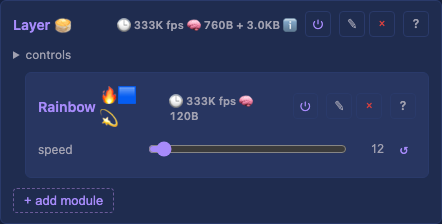
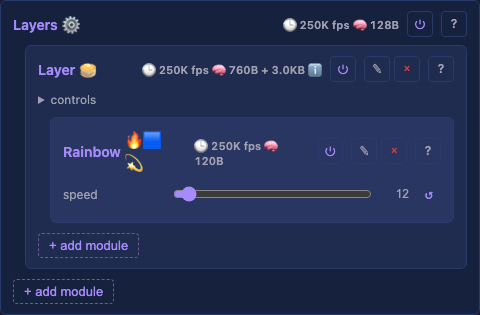
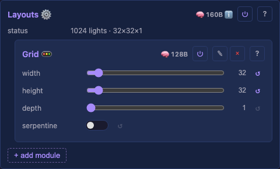
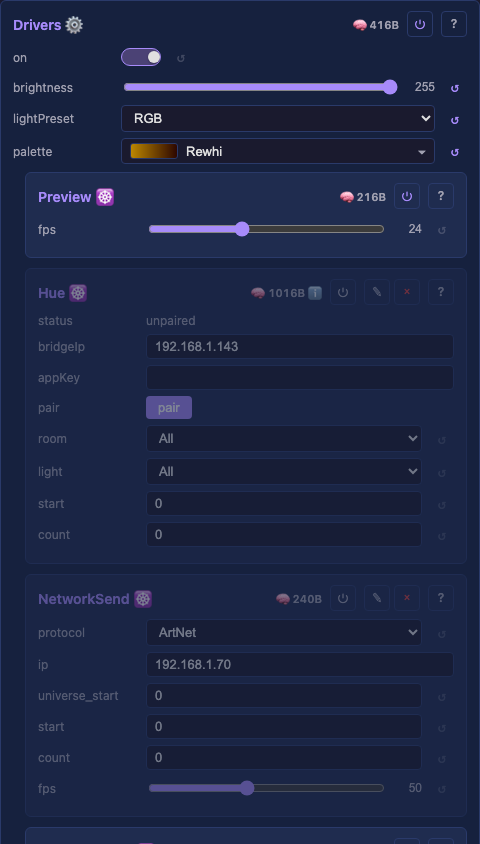

# Light supporting modules

The light-domain machinery the catalog modules (effects, modifiers, layouts, drivers) lean on — not directly user-facing. Every row links to its generated technical page (the full API, from the `.h`) and its tests. Cross-cutting rationale that no single `.h` owns lives in the prose sections below the table.

### Layer

One rendering layer — an effect writes into its buffer, modifiers transform the coordinate mapping, and the layer composites onto the shared output. The unit the render loop iterates.

- `blendMode` — how this layer composites onto the ones below (overwrite / alpha / additive).

Detail: [technical](../moxygen/Layer.md)

[Tests](../../../tests/unit-tests.md#layer)

### Layers

The container of layers — composites them (blend mode + opacity per layer) into the final light buffer.

Detail: [technical](../moxygen/Layers.md)

[Tests](../../../tests/unit-tests.md#layers)

### Layouts

The container of layout modules — walks each layout's coordinates to build the physical light set the mapping consumes.

Detail: [technical](../moxygen/Layouts.md)

[Tests](../../../tests/unit-tests.md#layouts)

### Drivers

The container of driver modules — owns the shared driver buffer and the per-light output correction every driver applies before sending.

- `on` — master power (default on). Turning it off scales the whole output to black while preserving `brightness`, so on restores the exact level. The single power control every consumer drives (the UI toggle, IR's on/off, the WLED app / Home Assistant, MQTT/Homebridge) through `Scheduler::setControl`.
- `brightness` — global output brightness (0–255).
- `lightPreset` — the output-correction preset (colour order, gamma, brightness) every driver applies.
- `palette` — the active palette effects sample from.

Detail: [technical](../moxygen/Drivers.md)

[Tests](../../../tests/unit-tests.md#drivers)

### Buffer

Contiguous light-data buffer, shared between the layers that write it (effects) and the driver groups that read it. A raw `uint8_t*` so any channel layout fits — RGB, RGBW, multi-channel DMX.

Detail: [technical](../moxygen/Buffer.md)

[Tests](../../../tests/unit-tests.md#buffer)

### MappingLUT

Maps the virtual grid to the physical sparse light set — a radius-4 sphere becomes its 210 real lights, not the 729-cell box. The lookup effects and the preview both consume.

Detail: [technical](../moxygen/MappingLUT.md)

[Tests](../../../tests/unit-tests.md#mappinglut)

### Effect base

The `EffectBase` class every effect derives from — the shared surface (buffer access, dimensions, the palette) an effect renders against.

Detail: [technical](../moxygen/EffectBase.md)

### Modifier base

The `ModifierBase` class every modifier derives from — transforms the coordinate mapping (mirror, rotate, multiply, …) a layer applies before rendering.

Detail: [technical](../moxygen/ModifierBase.md)
