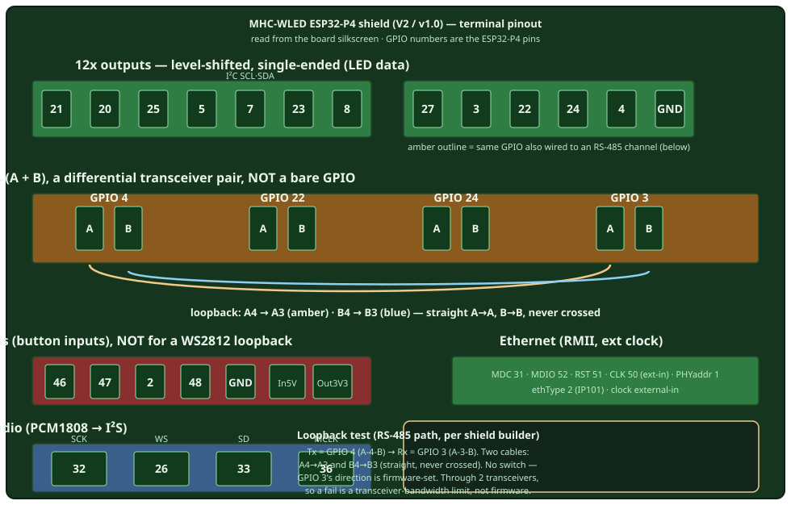

# MHC-WLED ESP32-P4 shield — hardware reference

Terminal pinout and onboard features for the **MHC-WLED ESP32-P4 shield** (myhome-control), the P4-NANO carrier used on the bench (catalog `deviceModel: "MHC-WLED ESP32-P4 shield"`, `esp32p4-eth` firmware). Read from the board silkscreen so projectMM work reads this instead of the marketing render. The shield sits on a **Waveshare ESP32-P4-NANO**; GPIO numbers are the P4's.

**Sources**
- Overview render (board V2): [`docs/assets/deviceModels/mhc-wled-esp32-p4-shield.jpg`](../assets/deviceModels/mhc-wled-esp32-p4-shield.jpg)
- Silkscreen (photographed, 2026-07-09): the terminal labels below are transcribed from the physical board, which supersedes the render where they differ (the render's RS-485 "GPIOs 3,4,6,53" is wrong — the board reads 4, 22, 24, 3).
- Builder: myhome-control (Wladi).

## Pinout

**Nothing on this shield is a bare GPIO.** Every terminal routes through protection or level-shifting — the reason a direct drive-and-read WS2812 loopback jumper fails on it (see below). Four terminal groups:

### 12x outputs — level-shifted, single-ended (LED data)

The LED-data outputs. Each terminal is `O<gpio>` on the silkscreen; a level shifter drives the 5 V strand from the P4's 3.3 V. The catalog wires the ParlioLedDriver to the first eight (`21,20,25,5,22,23,24,27`).

| Terminal | GPIO | Note |
|---|---|---|
| O21 O20 O25 O5 O23 O27 O22 O24 | 21 20 25 5 23 27 22 24 | LED lanes (ParlioLedDriver default) |
| O7 / O8 | 7 / 8 | also the I²C bus (SDA 7 / SCL 8, catalog I2cScan) |
| O3 | 3 | also on RS-485 (`A-3-B`) — see note below |
| O4 | 4 | also on RS-485 (`A-4-B`) — see note below |
| GND | — | ground for the output block |

> **GPIO 3, 4, 22, 24 each appear TWICE** — once here (level-shifted single-ended output, `O<n>`) and once in the RS-485 block (`A-<n>-B`). It's the *same* P4 GPIO fanned out to two output forms: driving the pin lights up **both** its `O<n>` terminal and its `A-<n>-B` transceiver at once. Wire to whichever form you need. GPIO 21/20/25/5/23/27 have **only** the level-shifted path (no RS-485), which is why the LED-driver default uses those + 22/24 for strips and leaves 3/4 free.

### 4x RS-485 — differential A/B pairs

Each channel is `A-<gpio>-B` on the silkscreen: an **RS-485 transceiver** (not a bare GPIO) driven by that GPIO. **Each channel occupies TWO screw terminals — an `A` and a `B`** (the differential pair), so the 4 channels are 8 terminals total. Channels on **GPIO 4, 22, 24, 3**. The render mentions "switch GPIO 3 as input/output," but there's **no physical switch on the board** — GPIO 3 is just a GPIO, and projectMM sets its direction in firmware (an output when driving, an input when `loopbackRxPin` reads it).

| Channel | GPIO | Terminals |
|---|---|---|
| A-4-B | 4 | A4, B4 |
| A-22-B | 22 | A22, B22 |
| A-24-B | 24 | A24, B24 |
| A-3-B | 3 | A3, B3 |

### 4x in/out header

The `O46 O47 O2 O48` header plus power (`GND`, `In5V`, `Out3V3`). Inputs are **diode-protected with a ~16 kHz low-pass filter** — designed for robust button-style inputs, not high-speed signals. GPIO 2 and 46 are P4 **boot straps**. This header is *not* usable for a WS2812 loopback (the filter and protection destroy the ~800 kHz waveform — the `hi=0 lo=0` continuity result that pinned this).

### Line-In audio (PCM1808 → I²S)

An onboard **PCM1808** ADC captures a line-in signal and outputs I²S to the P4. Catalog `AudioService`: **SCK 32 · WS 26 · SD 33 · MCLK 36** (the P4 is I²S master, so it drives MCLK).

### Ethernet (RMII)

The P4-NANO's RMII PHY: **MDC 31 · MDIO 52 · RST 51 · CLK 50 (external-in) · PHY addr 1**, `ethType` IP101, external clock. (Catalog `NetworkModule`.)

## Loopback self-test on this shield

The loopback self-test drives a WS2812 frame out one pin and reads it back on a jumpered pin — so it needs a **bare GPIO pair**. This shield exposes none: every terminal is buffered (level shifter, RS-485 transceiver, or diode + low-pass). **The self-test therefore does not apply to this shield — that's by design, not a firmware gap.**

- The frame-size fix the test exercises is **already proven** on the bare P4-NANO (direct GPIO 32↔33, PASS at every grid size), so the shield doesn't need to re-prove it.
- To verify LED output *on the shield*, the honest test is to wire a real **WS2812 strip to an `O<n>` output** and watch it light — that exercises the true path (GPIO → level shifter → strip), which is what the shield is built for.
- The RS-485 channels (the builder's suggested loopback path, Tx=GPIO 4 `A-4-B` → Rx=GPIO 3 `A-3-B`, wired A4→A3 / B4→B3) are **unlikely to work as a loopback**: projectMM drives pins as plain GPIO with **no RS-485 direction control** (no DE/RE driver-enable / receiver-enable toggling), so the transceivers won't reliably switch Tx↔Rx, and the differential path is slew-limited for an ~800 kHz WS2812 waveform anyway. Half-duplex RS-485 (DE/RE) is a real feature, not something the loopback path gets for free — see the [RS-485 / DMX-512 wired-output future extension](../backlog/backlog-light.md#rs-485-dmx-512-wired-output-future-the-physical-dmx-driver).

## Cross-reference

Chip-level GPIO constraints (straps, flash/PSRAM) for the P4 are in [gpio-usage.md § ESP32-P4](gpio-usage.md#esp32-p4); this page is the *board* wiring. The catalog entry is [`web-installer/deviceModels.json`](../../web-installer/deviceModels.json) (`MHC-WLED ESP32-P4 shield`).
