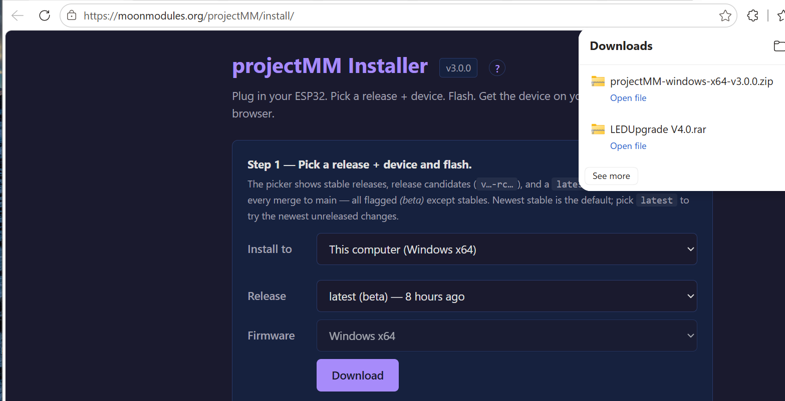
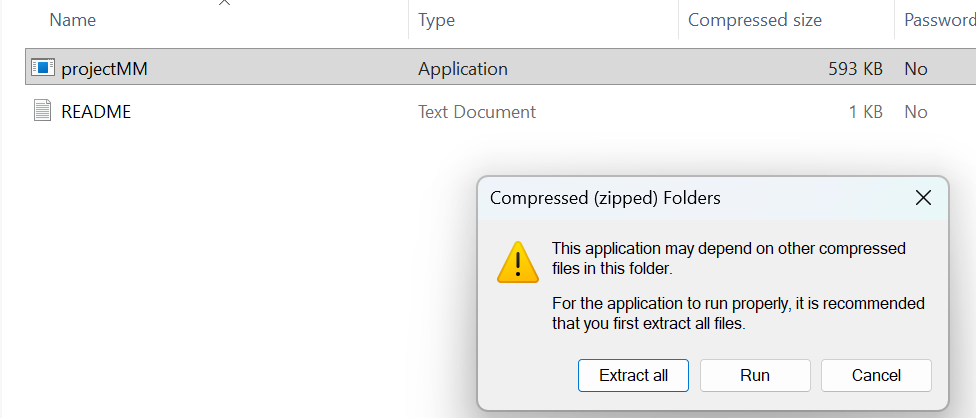
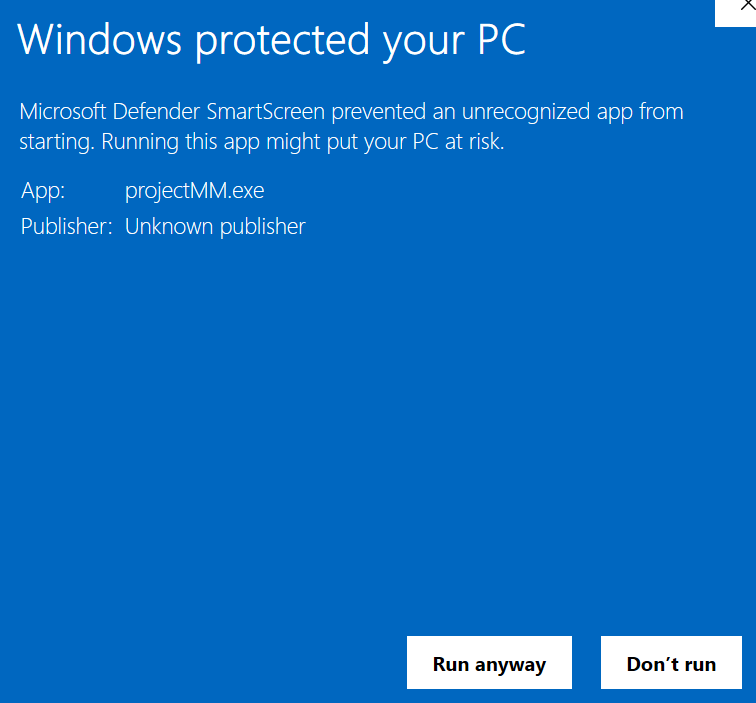
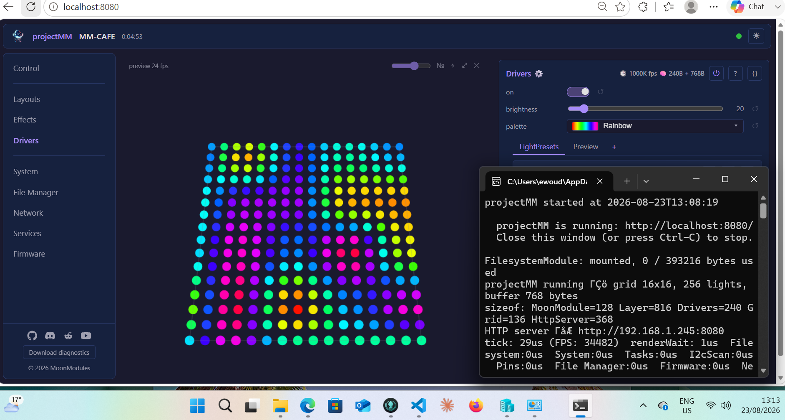

# Installing projectMM on a desktop

projectMM does not need an ESP32. The same code runs as an ordinary application on your computer, rendering effects, serving the web UI, and driving Art-Net, DMX and LED panel cards over the network. It is the quickest way to see projectMM working, and on a real PC the effects have far more compute behind them than any microcontroller can offer.

This page covers **Windows**. For macOS and Linux, the [README](https://github.com/MoonModules/projectMM#readme) has the download and first-run steps.

> Looking to flash a device instead? That is [Install & first light](../gettingstarted.md). This page is about running projectMM *on the computer itself*.

---

## 1. Download it

Open the [web installer](https://moonmodules.org/projectMM/install/) and set **Install to** to `This computer (Windows x64)`. The Release picker offers stable releases and `latest`, a build published on every merge to main; pick a stable one unless you want the newest unreleased changes.



**Download** gives you `projectMM-windows-x64-vX.Y.Z.zip`. There is nothing to sign up for and nothing else to install: the zip holds the application and a README, and that is all it needs.

## 2. Extract it, do not run it from inside the zip

Open the zip and Windows offers you **Extract all** or **Run**.



**Choose Extract all.** Running straight from a zip makes Windows unpack the application into a temporary folder that it may clear at any time, so you end up running a copy that quietly disappears later. Extract it somewhere you would keep a program, then run it from there.

## 3. Run it, and get past SmartScreen

Double-click `projectMM.exe`. The first time, Windows stops you:



This is expected. SmartScreen warns about any application it has not seen signed by a paid, registered publisher, and projectMM is not code-signed. It is a statement about the certificate, not about the file.

Click **More info**, then **Run anyway**. You only have to do this once for a given copy.

## 4. That is it

A console window opens showing what projectMM is doing, and your browser opens the interface at `http://localhost:8080/`.



The console window **is** the application. It shows the log, and closing it stops projectMM. The line that matters on a first run is `projectMM is running: http://localhost:8080/`; the address just below it (`HTTP server -> http://192.168.1.245:8080` in the screenshot) is the same interface reachable from your phone or another machine on your network.

Out of the box you get a 16x16 grid and a running effect, which is enough to confirm everything works. From here, [How projectMM works](how-projectmm-works.md) explains the Layouts, Effects and Drivers you see on the left.

Two options worth knowing: `--no-browser` stops it opening a browser (for a headless machine), and `--port <n>` serves somewhere other than 8080.

## 5. Where your settings live

Everything you change is saved automatically, in a folder that belongs to **your Windows user** rather than to the application:

```text
%LOCALAPPDATA%\projectMM
```

This applies from the release that introduced it. On an older build, settings sat in a `build\.config` folder beside the executable instead, and the log said `write failed` for each save when that folder could not be created.

The location is deliberate, and it has a consequence worth knowing: **your settings are not in the folder you extracted to**. Move the application, replace it with a newer version, or delete the extracted folder entirely, and your configuration is still there. To start completely fresh, delete that folder.

Paste `%LOCALAPPDATA%\projectMM` into the Explorer address bar to open it.

## 6. Or use the installer

From the next release there is also `projectMM-windows-x64-vX.Y.Z-setup.exe`. It does the same thing as the steps above, with less clicking: it installs for your user, so there is no administrator prompt, and adds a **Start-menu entry with an icon** and a proper uninstaller.

The zip stays available and is the right choice if you want to keep projectMM in a folder of your own, or run it from a USB stick.

Both are unsigned, so SmartScreen warns for either. Installing a new version over an old one keeps your settings, because the program and the settings live in different places; uninstalling removes the program and leaves your settings behind.

---

## When it does not start

| Symptom | Look at |
|---|---|
| SmartScreen has no **Run anyway** | Click **More info** first; the button is hidden until you do. |
| It opened and closed immediately | Run it from a terminal (`cd` to the folder, then `.\projectMM.exe`) so the error stays on screen instead of vanishing with the window. |
| The browser shows nothing at `localhost:8080` | Check the console window is still open. Closing it stops projectMM. If another program already uses port 8080, start with `--port 8081`. |
| Another machine cannot reach it | Use the `HTTP server ->` address from the log, not `localhost`. Windows Firewall prompts on first run; it needs to be allowed on your private network. |
| Settings do not survive a restart | The log will say `cannot use ... persistence disabled` and name the directory it tried. That is the fault, not the saving itself. |

---

## Where to go next

- **[How projectMM works](how-projectmm-works.md)**: the interface, and the Layouts / Effects / Drivers model.
- **[Driving LED panels with a receiving card](panel-cards.md)**: turn this desktop into the sending card for an LED wall.
- **[Install & first light](../gettingstarted.md)**: flashing an ESP32, if you want the same thing on a device.
