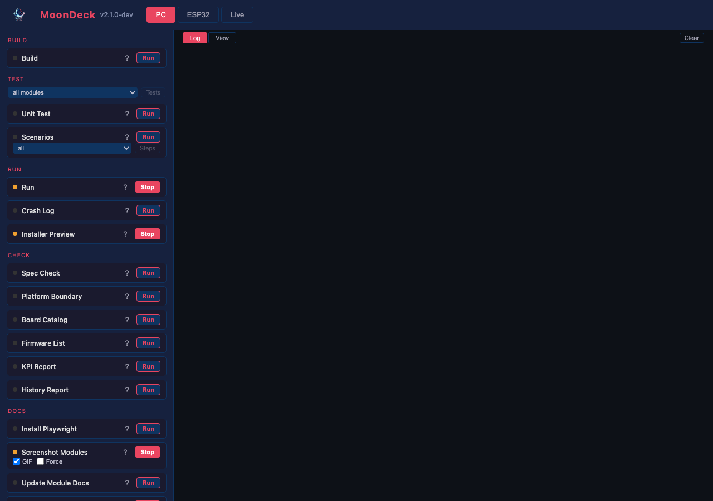
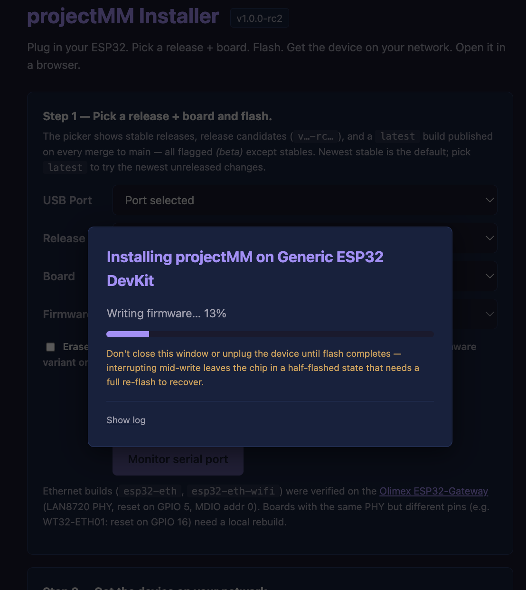
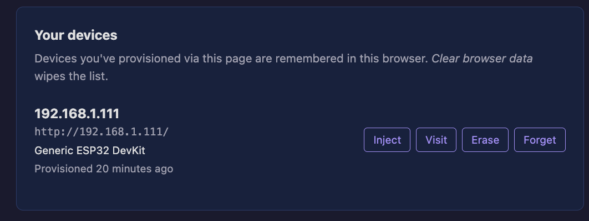
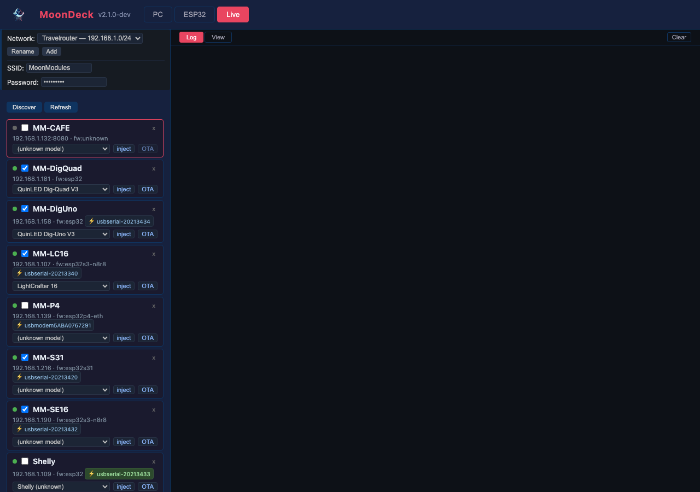
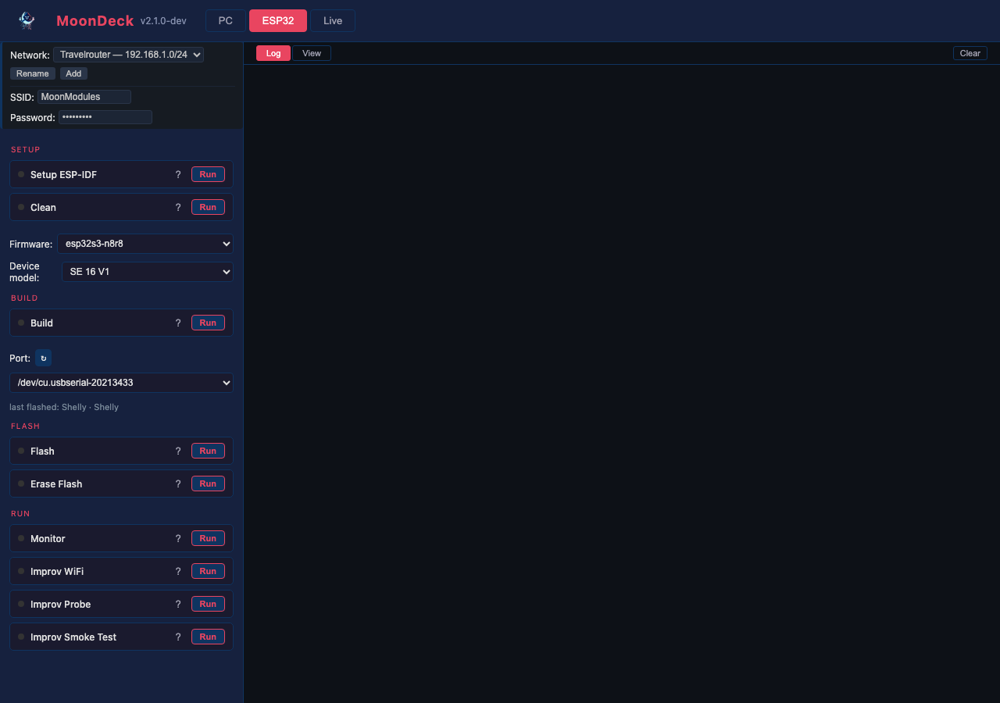

# MoonDeck Script Reference

MoonDeck is projectMM's browser-based developer console: one page that builds, flashes, runs, tests, monitors, and checks the project across every target, and discovers and drives devices on the network. Every action it offers is a thin wrapper around a script under `moondeck/`, so the CLI (`uv run moondeck/<group>/<name>.py`) and MoonDeck run exactly the same code — agents typically use the CLI, humans use MoonDeck. For what MoonDeck *is* and where it sits in the workflow see [docs/building.md § MoonDeck](../docs/building.md#moondeck--the-dev-console); this page is the per-script reference.

Launch it with `uv run moondeck/moondeck.py` and open <http://localhost:8420>. The console has three tabs — **Desktop** (build build / run / test), **ESP32** (chip + port, build / flash / monitor), and **Live** (discovery and live runs against networked devices) — above a network bar and per-device deviceModel pickers. Script definitions live in `moondeck/moondeck_config.json` (committed); runtime state (selected network, devices, ports) persists in `moondeck/moondeck.json` (gitignored).

Below: the UI behaviours common to every card, described once, then one section per script grouped by the tab it appears on. Each section gives the equivalent CLI invocation, so the page doubles as the command reference for running anything without the browser.

## UI Features

- **Status dots** on each card: grey (not run), orange (running), green (exit 0), red (exit non-zero).
- **Last-run log** — the **📄** button replays that script's last run in the log pane. It appears **only on cards that have actually run** (and shows up the moment a first run finishes, no reload needed), so its absence is informative too: a card with no 📄 is one nobody has used yet. Every run is teed to `build/moondeck-logs/<id>.log` as it streams (not buffered to the end, so a run you Stop still leaves what it printed), which answers "what did this do last time" after a page reload or a switch to another card — the case a live-only stream cannot. One file per script, overwritten each run: a last-run record, not a history. Gitignored, being derived state.
- **Run/Stop toggle** for long-running scripts (Run desktop, Monitor ESP32).
- **Duration hint** — every card shows how long it takes: ⚡ about a second, ⏱️ a few seconds up to ~30, 🐌 more than 30 seconds (a build, a flash, a gate list, clang-tidy). All three are shown rather than only the extremes, so a blank badge reads as "nobody set a speed on this card" instead of being confused with medium. Set per script as `"speed": "instant" | "medium" | "slow"` in `moondeck_config.json`. This is a *label*, not a timeout — nothing enforces it, so a script that grows slower needs its flag updated by hand. Separate from `long_running`, which controls the Run/Stop toggle rather than expected duration.
- **Group headers** in the sidebar (setup, build, flash, run, test, check, scenario).
- **Destructive-action confirm** — scripts flagged `destructive: true` (e.g. Erase Flash) pop a native confirm dialog before running.
- **Tab persistence** — selected tab survives page refresh.
- **Process detection** — on page load, checks if projectMM or idf.py is already running and shows Stop button.
- **Network bar** (top of the sidebar): switch between known networks. Each network holds its own device list, last-used serial port, and WiFi credentials (consumed by Improv). On startup, MoonDeck auto-selects the network whose subnet matches the host's current LAN — moving the laptop between networks usually requires no clicks. Manual override (the dropdown) pins the selection until the pinned network's subnet stops matching the host. Add / Rename buttons next to the dropdown manage the catalog. State persisted in `moondeck/moondeck.json` under `networks` + `active_network`.
- **Device-model picker** on each device row: dropdown of device models from [web-installer/deviceModels.json](../web-installer/deviceModels.json) — the same catalog the web installer uses. When the device's firmware uniquely identifies one deviceModel (e.g. `esp32-eth` → Olimex Gateway), MoonDeck auto-deduces and mirrors the value to the device's `deviceModel` control on [SystemModule](../docs/moonmodules/core/SystemModule.md) via `POST /api/control` on next discover. For firmwares with no unique deviceModel (`esp32` runs on multiple), the user picks; MoonDeck pushes that value too. A device-reported deviceModel not in the catalog still shows up as `<key> (unknown)` so the value survives. MoonDeck's picker is a **text dropdown for an already-running device** — distinct from the web installer's flash-time *picture* deviceModel picker; both read the same catalog, but MoonDeck doesn't need the per-deviceModel `image`/`url` fields (those are installer-picker UX). Selecting a deviceModel pushes its full catalog config — each entry is a list of `{type, id, parent_id?, controls?}` module units (the [nested catalog schema](../web-installer/README.md), add-then-configure), so MoonDeck adds the deviceModel's modules (`POST /api/modules`) then sets their controls (`POST /api/control`); see `_push_device` in [moondeck.py](moondeck.py).
## Desktop Tab




### build_desktop

Build the desktop firmware binary using CMake.

```bash
uv run moondeck/build/build_desktop.py
```

Runs `cmake -B build/<host> -DCMAKE_BUILD_TYPE=Release` then `cmake --build build/<host> --target projectMM`, where `<host>` is `macos`, `linux`, or `windows` depending on the OS this script runs on. It builds ONLY the firmware binary — not the ~130-file test suite — so the "just give me the binary to run" path stays fast; compile the tests separately (see `compile_tests`). The per-host directory keeps an experimental Linux build from clobbering a macOS one on the same machine, and mirrors the ESP32 side's `build/esp32-<board>/` shape.

### compile_tests

Compile the test binaries (unit + scenario) without running them.

```bash
uv run moondeck/build/build_desktop.py --tests
```

Builds `mm_tests` + `mm_scenarios` (the `--tests` target set of `build_desktop.py`), in the same per-host build dir. Separate from `build_desktop` so a firmware build doesn't drag the ~130 test translation units through the compiler; run the compiled binaries afterward with `test_desktop` (unit) and `scenario_pipeline` (scenarios).

### test_desktop

Run the desktop test suite.

```bash
uv run moondeck/test/test_desktop.py
```

Runs `./build/<host>/test/mm_tests -s` (doctest with all test cases shown) — same per-host build dir as the desktop build above.

### run_desktop

Launch the desktop executable as a detached background process and exit. The app keeps running across other MoonDeck scripts and outlives MoonDeck itself — the same model as flashing an ESP32, where the device runs independently of this console.

```bash
uv run moondeck/run/run_desktop.py
```

Re-running is idempotent: any existing `projectMM` instance is stopped first, then a fresh one is launched. Output goes to `build/<host>/projectMM.log`. Build first.

While the app is running, MoonDeck shows the button as **Stop** (a 5-second poll on `/api/running` detects the live process via `process_name`). Pressing Stop terminates the app; pressing Run again restarts it. From the CLI: `pkill -f build/<host>/projectMM` (or `pkill projectMM` if you don't have multiple host builds active).

### preview_installer





Locally preview the web installer page at <https://moonmodules.org/projectMM/install/> without tagging a release. Stages `web-installer/index.html` + `src/ui/install-picker.js` into `build/install-preview/` and serves them via Python's `http.server` on port 8421.

```bash
uv run moondeck/run/preview_installer.py
# open http://localhost:8421/ in Chrome / Edge / Opera
```

Long-running — MoonDeck shows **Stop** while the server is up. Two modes, picked automatically:

- **Render-only.** When no `build/esp32-*/projectMM.bin` is present, the picker populates against the real GitHub Releases API and dropdowns work, but clicking **Install** fails because the local server has no `releases/` tree. Useful for iterating on HTML / CSS / JS without burning a build. Equivalent to "Recipe A" in [web-installer/README.md](../web-installer/README.md).
- **Flash-ready.** When at least one ESP32 build exists, the script additionally stages every `build/esp32-*/projectMM.bin` it finds into `releases/local-dev/` and generates matching Pages-relative manifests via the same `generate_manifest.py` the release workflow uses. The picker shows `local-dev` as the newest tag; clicking **Install** flashes a USB-connected ESP32 and hands off to the repository's custom orchestrator UI (Improv-Serial provisioning + SET_DEVICE_MODEL + control fan-out, all in `install-orchestrator.js` — not ESP Web Tools). End-to-end, same code paths as the public installer. This is the developer's test ground for the install flow before deploying to GitHub Pages: Web Serial works on `http://localhost` without the secure-origin requirement that gates the public site.

Add `?nocache=1` to the URL to bypass the picker's 5-minute sessionStorage cache while editing.

### check_specs

Verify every implemented MoonModule has a matching, up-to-date spec.

```bash
uv run moondeck/check/check_specs.py
```

Scans `src/` for MoonModule `.h` files and checks each has a `docs/moonmodules/*.md` page whose control names / source facts still agree with the header. The always-run commit gate (fast, <1s) — catches `.h` ↔ doc drift even on doc-only commits.

### check_platform_boundary

Verify that platform-specific code stays inside `src/platform/`.

```bash
uv run moondeck/check/check_platform_boundary.py
```

Scans all source files outside `src/platform/` for forbidden includes and platform `#ifdef`s.

### check_esp32_built

Check that a firmware binary exists and is newer than every source that feeds it.

```bash
uv run moondeck/check/check_esp32_built.py --firmware esp32s3-n16r8
```

The cheap stand-in for a full `idf.py build` in the commit and merge gates. Freshness is measured against the **sources**, not the clock: a wall-clock rule ("built in the last hour") passes a binary that predates an edit made twenty minutes ago, which is the stale-artifact trap that sends debugging at the wrong image. On failure it names the newer file and prints the rebuild command. `--max-age-hours N` adds an optional age rule on top; the default (0) disables it.

### event_precommit / event_premerge / event_prerelease

Run the gate list for one lifecycle event ([CLAUDE.md § The Process](../CLAUDE.md#the-process)).

```bash
uv run moondeck/event/precommit.py                    # commit event
uv run moondeck/event/precommit.py --build-esp32      # …compiling the firmware for real
uv run moondeck/event/precommit.py --firmware esp32   # pick the ESP32 variant
uv run moondeck/event/premerge.py                     # merge event (branch diff vs main)
uv run moondeck/event/prerelease.py                   # release event (diff vs previous tag)
```

Each gate carries an objective trigger read from the changed-file set, so a docs-only change runs the spec check and skips the rest, while a `src/` change runs the full list. Every gate reports **PASS** (ran, succeeded), **FAIL** (ran, failed), **SKIP** (trigger did not match) or **MANUAL** (a human decision — hardware, review, release criteria — listed, never auto-failed). Gates do not stop at the first failure: one pass gives the whole picture, and the run ends with a `DONE` line so a long run's finish is unambiguous. The scripts are **product-owner initiated** and never commit, merge, or tag.

**The commit list is built to stay under ~10 seconds**, because a gate list nobody runs protects nothing. Two steps that would otherwise dominate it are deliberately cheap:

- **ESP32 is a freshness check, not a compile** — [check_esp32_built](#check_esp32_built) instead of a cold `idf.py build`. `--build-esp32` compiles for real; `prerelease.py` always does, since that is the event where the binary ships; CI builds every variant on every PR regardless.
- **KPI skips the live serial capture** — the gate passes `--no-live-capture` (see [collect_kpi](#collect_kpi)), so it needs no bench board and costs seconds.

### check_devices

Validate the installer device-model catalog (`web-installer/deviceModels.json`).

```bash
uv run moondeck/check/check_devices.py
```

Checks each entry's required fields, that `firmwares` is a non-empty list, every `image` resolves on disk, the `System.deviceModel` control equals the entry name, module `type`s are factory-registered, `pins` controls live only on `*LedDriver` modules, and `flashBaud` (if set) is a standard esptool rate. The catalog's counterpart to `check_specs` for module docs.

### check_firmwares

Verify the firmware projection (`web-installer/firmwares.json`) matches the `FIRMWARES` source.

```bash
uv run moondeck/check/check_firmwares.py
```

Regenerates the firmware list from `build_esp32.py`'s `FIRMWARES` dict and fails on drift from the committed `firmwares.json` — so a `FIRMWARES` edit without regenerating is caught.

### collect_kpi

Collect the per-target KPI line (tick/FPS, memory, sizes) for the commit message.

```bash
uv run moondeck/check/collect_kpi.py                          # full interactive report
uv run moondeck/check/collect_kpi.py --commit                 # the commit-message form
uv run moondeck/check/collect_kpi.py --commit --no-live-capture   # skip the serial read
```

Captures a live tick from a connected ESP32 (and the desktop scenario ticks) plus source/test line counts, emitting the `tick:Xus(FPS:Y)` one-liner the commit message records.

The ESP32 half reads `esp32/monitor.log`, and refreshes it by opening the serial port for 15 s when that log is older than 5 minutes — accurate, but ~80 s and only possible with a bench board attached. `--no-live-capture` skips that refresh and uses whatever log exists (a few seconds, no board needed); the ESP32 tick line is then absent rather than stale when no recent log is around. The gate lists pass the flag so their cost stays predictable; omit it when composing a commit message, where the fresh reading is the point.

In `--commit` mode it also writes the repo-health snapshot (below), reusing the tick/FPS it just measured.

### repo_health

Measure the repo's current state into `repo-health.json` — flash per firmware variant, tick/FPS per target, lines of code by area, comment density, test counts, docs inventory.

```bash
uv run moondeck/check/repo_health.py           # measure + print the delta, write nothing
uv run moondeck/check/repo_health.py --write   # rewrite repo-health.json
```

**One small file, current state only — the trend is its git history** (`git log -p repo-health.json`), so the file never grows. The KPI gate rewrites it on every `--commit` run and prints the delta first, so growth is visible while you work and again in the commit's diff. A **soft ratchet**: nothing here fails a build. The numbers count things; they cannot tell a valuable comment from a restating one, so the judgment stays human.

Two properties worth knowing. Measurements read **tracked files only** (`git ls-files`), so a stray build artifact or scratch file can't move a number. And anything this run could not measure — a firmware variant that wasn't built, a tick with no board attached — **carries its previous value forward** rather than disappearing, so a docs-only commit doesn't blank the flash sizes and make the next diff unreadable.

### Tools group

Static-analysis tools, run **manually**: they take minutes rather than seconds, so they are not
in the commit/merge gate lists yet.

**A report shows the real situation.** Array usage, hot-path blocking, complexity — the number
is only worth reading if nothing was hidden to make it smaller. A finding is *fixed*, or it is
*shown with its reason*; it is never suppressed to tidy the output. `ParallelLedDriver::tick`
and `PreviewDriver::tick` genuinely block, so they appear in clang-hotpath every run — hiding
the two worst offenders would have made the report worthless while making the count look better.
The only suppression that earns its place is one where the tool is wrong about our code (e.g.
libc++ not annotating `steady_clock::now`, which does not block), and it carries that reason at
the site.

### check_module

Every static-analysis tool, on ONE module — the repo-wide reports turned around.

```bash
uv run moondeck/check/check_module.py --module Control
uv run moondeck/check/check_module.py --module Layer --skip clang-tidy
```

The other tool cards sweep the whole repo, which is the wrong shape when you are working on one
file and want to know what the tools say about *it*. This runs clang-tidy, clang-query and
lizard against one module and prints them under one heading. It adds no analysis of its own —
it invokes the same scripts with `--module`, so this and the repo-wide reports can never
disagree about a finding. Each tool also accepts `--module` on its own if you want just one.

**Module is not the same as a translation unit.** A TU is one `.cpp` plus everything it
includes — the unit the compiler processes, and there are 15 under `src/`. A module is one class
with its `.h` and optional `.cpp`, and there are ~90. Most are **header-only**, so they have no
TU of their own: `ParallelLedDriver.h` is analysed through whichever `.cpp` includes it. That is
why `--module` filters the findings rather than the file list — scoping by TU would analyse
nothing for a header-only module and report a confident, wrong zero.

It still scopes the *parse*, by resolving which TUs actually reach the module's files —
following `#include` edges transitively, so a header-only module is analysed through the one or
two `.cpp` files that include it rather than all 15. `BouncingBallsEffect` is reached only by
`main.cpp`: **8s for all three tools, down from over four minutes**. The run prints which TUs it
picked, so the scope is visible rather than assumed.

### check_clang_tidy

Run clang-tidy over the whole tree and write a Markdown report.

```bash
uv run moondeck/check/check_clang_tidy.py                              # full run, report to stdout
uv run moondeck/check/check_clang_tidy.py --check bugprone-infinite-loop   # one check, for triage
```

Configured by [`.clang-tidy`](../.clang-tidy) at the repo root — the same file clangd reads, so
this report and your editor agree. Takes ~2-3 minutes; the baseline is **zero findings**, so
anything it prints is new.

The findings print straight to the log — a per-check summary, the worst files, then every
finding grouped by file. No report file to open: a run this slow should answer on the spot,
and the old `build/clang-tidy-report.md` was gitignored anyway, so it existed only to be read
once.

**Verify a zero before believing it** ([testing.md](../docs/testing.md#verify-a-zero-before-believing-it)
covers why and lists the known silent-failure modes). This script's own guard: it refuses to
report when more than ten files fail to compile.

### check_clang_query

Our own AST rules — the checks we invent, that no off-the-shelf tool reports.

```bash
uv run moondeck/check/check_clang_query.py               # every rule
uv run moondeck/check/check_clang_query.py --rule=arrays # one rule
uv run moondeck/check/check_clang_query.py --min-bytes=256
```

One script holding a **growing list** of rules, not one script per rule: a new rule is a matcher
plus a few lines of Python, so it costs a list entry rather than another card and another help
page. clang-query rather than a compiled clang-tidy plugin — matchers are plain text, there is no
plugin to build and no LLVM ABI to track, and clangd cannot load a compiled plugin anyway.

**Rule `arrays` — fixed arrays that cost RAM.** A fixed array is a fixed size, and the
architecture sizes buffers at runtime from available memory. Reported worst-first, split by where
the RAM lives, because the fix differs:

| Where | Cost | Why it matters |
|---|---|---|
| `local` | Stack | A 2 KB local on a 4 KB task stack is an overflow waiting for the wrong call depth. |
| `member` | Per instance | Multiplied by how many instances exist — 200 bytes × 90 modules is 18 KB. |

`constexpr` and static-storage arrays are **excluded**: they live in flash and cost no RAM.
Including them roughly triples the list with entries nobody should act on. `MoonModule::name_[16]` is the cautionary case: its
comment records that it was *shrunk* from `char[24]` to save 8 bytes per module, so reporting it
would flag a past win as a problem.

Element sizes come from a table of the types we actually use; anything else (a struct, a class)
falls back to 4 bytes. The number is an order-of-magnitude guide, not an ABI-exact figure.

**No size threshold.** Every RAM-costing array is reported, however small — a cutoff hides
things for the wrong reason (`bool birthNumbers_[9]` is 9 bytes and was invisible under the old
10-byte default), and it bought little anyway: 362 findings with no threshold against 290 at
>10 bytes. Volume is capped by `--max-rows` (default 60, worst-first) instead, which truncates
the longest lists rather than silently dropping the smallest entries — and the cut is always
announced, because a table that quietly stops reads as "that is all there is". `--max-rows 0`
prints everything, and `--min-bytes N` restores a size cutoff — both CLI-only, since the card is
one button and the default plus the "N more not shown" line already answer the question from the
browser.

The per-module card runs with no cap: you scoped to one module precisely to see all of its
findings, and `HttpServerModule` alone has 71 arrays.

**Rule `scratch` — `ScratchBuffer` members.** `ScratchBuffer` *is* the project's heap manager,
so a module that uses one allocates without any `new` or `malloc` appearing in its own source —
`GameOfLifeEffect` has three (`cells_`, `future_`, `colors_`) and the `heap` rule reports zero
for it, because the real `platform::alloc` lives once inside `ScratchBuffer.cpp`. This rule
closes that blind spot: 18 members across 13 files. No size column — a ScratchBuffer is sized at
runtime from the light count, which is the entire point of it.

**Rule `heap` — every allocation site in `src/`.** `new` / `delete` / the `malloc` family
(including `heap_caps_*` and `ps_malloc`), in **two tables — ALLOCATE and FREE**. They answer
different questions: the acquire list is where RAM comes from and what the hot path must not do;
the release list is what pairs with it. Reading them side by side is how an unpaired allocation
shows up — and the split is what reveals, for example, that `HttpServerModule` frees five times
and allocates nothing, or that only **8 places in the whole codebase acquire memory**.

Each row carries what the site is, what it touches, and **the enclosing function** — the column
that turns a location into a lead ("this file allocates" is weak, "`handleConnection` allocates"
says where to look). `realloc` counts as acquiring, since it can move and grow. Not violations:
the driver layer allocates deliberately, but the hot path must not.

Member methods named `free()` are excluded. We have three (`MoonLive`, `Buffer`, `MappingLUT`),
and matching on the name alone counted every call to them as heap deallocation — 15 false
positives pointing at the wrong lines.

Takes ~50s cold (a few seconds once the compilation database is warm). clang-query has no
parallel runner of its own and costs ~44s per translation unit, so this runs the 15 `src/` TUs
across cores; serial would be ~11 minutes.

### check_nonblocking

What the render path calls that can block or allocate — checked by the compiler.

```bash
uv run moondeck/check/check_nonblocking.py                # summary by callee, then every site
uv run moondeck/check/check_nonblocking.py --module AudioService
```

`MoonModule::tick/tick20ms/tick1s` carry `MM_NONBLOCKING` ([platform.h](../src/platform/platform.h)),
and Clang 20+ verifies under `-Wfunction-effects` that nothing they reach allocates or blocks —
**transitively**, through the whole call graph ([coding-standards.md § Static checks](../docs/coding-standards.md#static-checks) owns the rule).

The attribute is inherited by overrides, so three annotations cover every module's tick. It also
sits in `tickChildren`'s **member-pointer type** — without that, the indirect call through `fn`
is a hole the check cannot reason about, and passing an unannotated method now fails to compile.

Reports unique **sites**: a header included by N translation units emits the same warning N
times, so a raw build prints ~1350 lines for ~180 real findings.

**Split by tick tier**, because the same blocking call costs roughly two orders of magnitude
more in one than another: `tick()` runs every frame, `tick20ms()` fifty times a second, `tick1s()` once.
Pooling them hides which findings actually matter. `OTHER` is a site whose enclosing method could
not be resolved from source.

| Column | |
|---|---|
| **CALLS** | the function that blocks — or `(static local variable)`, a violation with no callee: a static local needs a guard variable and a one-time lock on first use |
| **IN** | the method the call sits in, which is what places it in a tier. Clang names the call and the callee but *not* their enclosing function, so this is read back from the source |
| **WHY IT BLOCKS** | clang's own root cause, e.g. `calls mm::platform::UdpSocket::sendTo`. `—` means a leaf the compiler could not look inside (external or unannotated) |
| **FILE:LINE** | where to go |

**Desktop-only, and that loses nothing.** On GCC `MM_NONBLOCKING` expands to `noexcept` — the
exception contract still holds; only the clang attribute and the warning are absent. The ESP32 toolchain
has neither the attribute nor the warning, and builds with `-Werror`, so a bare attribute there
is a build break. Every tick method compiles on desktop — modules, effects, and the **LED
drivers** — so the render path itself is covered.

The gap is real but narrow: `src/platform/esp32/` has no tick methods (it is free functions the
tick path calls into), and while a call INTO one of them is reported at the call site, the
function's own body is never analyzed. A platform function that blocks internally without
carrying `MM_NONBLOCKING` is invisible. Closing that needs an xtensa clang — backlogged as
"ESP32 clang/LLVM toolchain" in backlog-core.md.

Not a gate yet: `-Wno-error=function-effects` keeps the build green while the findings are
triaged. Each is a judgement — fix it, annotate the callee, or accept it with a scoped reason.

### check_lizard

Complexity gate: fail on **new** over-complex functions, not the ones already there.

```bash
uv run moondeck/check/check_lizard.py             # report NEW violations, exit 1 if any
uv run moondeck/check/check_lizard.py --all       # every violation, baseline ignored
uv run moondeck/check/check_lizard.py --baseline  # rewrite whitelizard.txt from today
```

Results print as one table, sorted worst-first, so the top row is the next thing worth
simplifying. The five numbers are the same ones lizard's own summary reports:

| Column | Meaning | Gated |
|---|---|---|
| **CCN** | Cyclomatic complexity — independent paths through the function: 1, plus one for every branch point (`if`, `for`, `while`, `case`, and each short-circuit `&&` / logical-or operator). The count of things that must hold at once to reason about it, and the number of tests needed to cover it. | **Yes**, > 10 |
| **NLOC** | Non-comment lines of code — the body's real size, blank lines and comments excluded. | **Yes**, > 60 |
| **TOKEN** | Total tokens (identifiers, operators, literals). Density rather than length: a high TOKEN against a modest NLOC means long, packed expressions. | No |
| **PARAM** | Parameter count. A long list usually means the function does several jobs, or wants a struct. | No |
| **LINES** | Raw line span, first to last — **includes** comments and blanks, so `LINES` minus `NLOC` is roughly how much of the function is documentation. | No |

A `*` next to CCN or NLOC marks which threshold tripped. It matters because the two point at
different fixes: `HttpServerModule::handleConnection` is `93* 178*` (both — split it), while
`json::parseString` is `40* 47` — branchy but short, so it wants a lookup table rather than a
split. TOKEN, PARAM and LINES are context for *why* a function is heavy; nothing gates on them.

A raw run reports 162 functions over threshold (CCN > 10 or NLOC > 60), and a metric that can
never reach zero is a poor gate — people stop reading it. So [`docs/metrics/whitelizard.txt`](../docs/metrics/whitelizard.txt)
freezes today's set and the check fails only on something new. The baseline is lizard's own
`--whitelist` format, matched on **file + function name** rather than line numbers, so it
survives edits above a function.

**The list only shrinks.** Simplify a function, delete its line; the check reports baselined
entries that no longer violate so they don't linger. Adding a line means admitting a new
violation, which is the thing this exists to prevent.

Lizard owns the complexity number (`collect_kpi.py` reports the same 162 for the repo-health
trend); clang-tidy's `readability-function-*` checks stay off so one rule has one owner.

### scenario_pipeline

Run scenario tests. Replays JSON scenario files in-process.

```bash
uv run moondeck/scenario/run_scenario.py                       # run all
uv run moondeck/scenario/run_scenario.py --name scenario_Layer_base_pipeline   # run one
```

Scenarios are JSON files in `test/scenarios/`. Use the dropdown to run a single scenario or leave it on **all** to run the full suite.

For a full description of each scenario, see the [scenario inventory](/api/docs/tests/scenario-tests.md) — auto-generated from the JSON files.

### history_report

Generate a human-readable history report from `git log` + `gh release list`. Writes a single markdown file at `build/history.md` (gitignored — the report is an artifact, not source; storing it in the repo would duplicate what git already carries).

```bash
uv run moondeck/report/history_report.py              # default: build/history.md
uv run moondeck/report/history_report.py --out /tmp/h.md
```

Output shape:

- **Releases** table: the most-recent 10 tagged releases with tag, date, and channel (stable / rc / latest).
- **History** section: combined graph + commits, newest first. Each commit row shows its graph-rail (`*`, `| *`, `*   `, …) as a monospace prefix to the SHA + date + subject. Merge commits get a ⤴ badge. The full body lives in a left-bordered blockquote underneath, visually extending the rail's vertical line into the description. Branch connector rows (`|\`, `|/`, `| |`) render as standalone monospace lines between commits. Inside each body, `- foo` lines render as nested bullet lists. Each SHA links to the corresponding GitHub commit page when an origin remote is configured.
- **Summary** footer: commit count, release count, generation timestamp.

The MoonDeck button writes the file, prints a `MOONDECK_VIEW: /api/history-report` marker that the log renderer auto-opens in the View pane (and renders as an "Open in View pane → …" clickable link). Re-runs on identical git state produce a deterministic file except for the timestamp line in the footer.

### screenshot_modules

Capture UI screenshots of every module that has controls and save them to `docs/assets/`.

```bash
uv run moondeck/docs/install_playwright.py    # one-time (or use Install Playwright button in MoonDeck)
uv run moondeck/docs/screenshot_modules.py    # requires projectMM running on localhost:8080
uv run moondeck/docs/screenshot_modules.py --host 192.168.1.210:8080
uv run moondeck/docs/screenshot_modules.py --gif    # also record 3-second GIF previews
uv run moondeck/docs/screenshot_modules.py --force  # re-capture and overwrite existing screenshots
```

The **GIF** and **Force** checkboxes in MoonDeck toggle these flags.

Connects to a running projectMM server, builds a minimal pipeline scaffold (Layouts → Grid, Layer, Drivers), adds each module, screenshots its card, then removes it. Saves:

- `<TypeName>.png` — module card screenshot for every module in the catalogue
- `<TypeName>.gif` — 3-second preview animation for effects and modifiers (requires `--gif`)
- `ui_overview.png` — full-page screenshot of the projectMM UI
- `moondeck_desktop.png`, `moondeck_esp32.png`, `moondeck_live.png` — MoonDeck tab screenshots (requires MoonDeck running on port 8420)
- `installer.png` — web installer preview (requires `preview_installer` running on port 8421)

Without `--force`, existing screenshots are skipped — only missing files are captured. Run with `--force` to re-capture everything (e.g. after a UI change).

GIF capture uses ffmpeg (install with `brew install ffmpeg`). Each GIF is assembled from frames captured via Playwright — the WebGL canvas is read via `page.screenshot(clip=...)` rather than `canvas.toDataURL()` to work correctly in headless mode.

After capture, run `update_module_docs` to insert the references into the module spec files.

### update_module_docs

Insert screenshot and GIF references into `docs/moonmodules/**/*.md` files.

```bash
uv run moondeck/docs/update_module_docs.py            # update all
uv run moondeck/docs/update_module_docs.py --dry-run  # preview without writing
```

For each `.md` file, if `docs/assets/<type-folder>/<TypeName>.png` exists and the file doesn't already contain a screenshot reference, inserts the image after the first heading. If a matching `<TypeName>.gif` also exists, inserts the GIF reference on the next line. Safe to re-run — skips files that already have all references.

Also inserts MoonDeck tab screenshots and the installer screenshot into `moondeck/MoonDeck.md` and `README.md` at fixed anchor points (defined in the `EXTRA_SHOTS` list in the script).

Reports unreferenced screenshots — any PNG or GIF in `docs/assets/` not mentioned anywhere in `docs/` or `moondeck/`.

### build_docs

**Preview Docs Site** — serve the documentation site (Material for MkDocs) from the `docs/` tree with live-reload, so you can view and iterate on it. Long-running: MoonDeck shows **Stop** while the server is up (like Installer Preview); a stray `mkdocs serve` is killed before a new one starts. The button passes `--serve`.

```bash
uv run moondeck/docs/build_docs.py --serve     # what the button runs → http://localhost:8422/projectMM/ (auto-reload)
uv run moondeck/docs/build_docs.py            # one-shot build to site/ (CI parity; no server)
uv run moondeck/docs/build_docs.py --strict    # promote every warning to an error (local anchor audit)
```

The preview binds **:8422** — the [Installer Preview](#preview_installer) owns :8421 and MoonDeck :8420, so all three servers run at once. Config is `mkdocs.yml`; deps (`mkdocs-material`) are declared inline in the script, so `uv run` provisions them on first use. The two test-inventory pages and each effect/modifier's inline test list are generated from the test files at build time (`moondeck/docs/mkdocs_hooks.py`), so they're never committed and can't drift; `history/` and `backlog/` are built but kept off the nav. Warnings for links to repo files outside `docs/` (rewritten to GitHub URLs) and pre-existing stale anchors are expected — the build still succeeds.

## Live Tab




### live_scenario

Run scenario tests against a live running device via HTTP.

```bash
uv run moondeck/scenario/run_live_scenario.py                                    # all scenarios vs localhost:8080
uv run moondeck/scenario/run_live_scenario.py --host 192.168.1.210               # vs ESP32
uv run moondeck/scenario/run_live_scenario.py --name scenario_MoonModule_control_change   # one scenario
uv run moondeck/scenario/run_live_scenario.py --update-baseline                  # save baseline
uv run moondeck/scenario/run_live_scenario.py --compare-baseline                 # detect regressions
```

Executes scenario steps (add_module, set_control, delete_module) via REST API. Collects per-step FPS and heap measurements. Compares against stored baselines to detect performance regressions. Use the dropdown to run a single scenario or leave it on **all** to run the full suite.

For a full description of each scenario, see the [scenario inventory](/api/docs/tests/scenario-tests.md) — auto-generated from the JSON files.

### run_network_live

End-to-end lights-over-UDP matrix test across every online board in moondeck.json's active network — the live proof for [NetworkReceiveEffect](../docs/moonmodules/light/effects.md#networkreceive) and [NetworkSendDriver](../docs/moonmodules/light/drivers.md#networksend). Each round one device is the sender and every other device listens: the desktop seeds the sender **three times — once per protocol (ArtNet, E1.31, DDP), each with its own color** — asserting the sender's `/ws` preview stream shows each one, then points the sender's own NetworkSendDriver at each listener with the protocol control cycled round-robin and asserts the listener's preview shows the sender's corrected color (brightness + channel order replicated host-side). With one device online only the desktop→device sweep runs.

```bash
uv run moondeck/scenario/run_network_live.py                      # full matrix over all online devices
uv run moondeck/scenario/run_network_live.py --device MM-70BC     # only rounds with this sender
uv run moondeck/scenario/run_network_live.py --tolerance 1        # loosen the per-channel byte match
```

Everything it mutates (grid size → 16×16 for the run, NetworkSend `ip`/`protocol`/`enabled`, the temporarily added NetworkReceive effect) is restored afterwards, also on failure. Exit codes: `0` = all legs passed, `1` = a leg failed, `2` = environment problem (no online devices / no moondeck.json). Desktop listeners may need the OS firewall to allow UDP 6454/5568/4048.

### run_network_roundtrip

Minimal **desktop→device→desktop latency probe** across **all three protocols**: per device, the desktop sends one solid-color frame over ArtNet, then E1.31, then DDP, each time timing how long until that color appears in the device's `/ws` preview stream (desktop → NetworkReceiveEffect → PreviewDriver → desktop). The receiver autodetects each protocol on its own port, so there's no device reconfig between them. Reports min / median / max over N repeats per protocol and a per-device median-per-protocol comparison line — the spread is the signal for the latency / hiccup symptom, the protocol comparison shows which transport is fastest on a given board, and running across boards makes the per-chip difference visible (a classic ESP32 measures slower than an S3). Runs against **every device checked in the Live tab** (the same `selected` set the matrix test uses); unreachable checked devices are warned and skipped. The measured time includes the PreviewDriver's own fps quantisation (≈42 ms at the 24 fps default), so it's "state visible within" latency, not wire latency; raise the device's Preview fps to tighten it. Deliberately minimal — per-frame sequence matching, the device→device chain, and jitter/drop histograms are left as later extensions.

```bash
uv run moondeck/scenario/run_network_roundtrip.py                  # every checked device, 10 probes each
uv run moondeck/scenario/run_network_roundtrip.py --host 192.168.1.156 --repeats 20   # one explicit device
```

Captures and restores each device's grid and removes the temporary NetworkReceive on exit (also on failure). Exit codes match the matrix test: `0` = at least one device measured, `1` = none returned a frame, `2` = environment problem (no checked/reachable devices).

### preview_health

Browser-faithful **3D-preview stream health probe** — measures the device's `/ws` preview the way a real browser tab experiences it, so the numbers match what a person watching the [PreviewDriver](../docs/moonmodules/light/drivers.md#preview) preview sees. A plain one-shot WebSocket reader gives up the moment the device closes the socket, so it reports stalls a browser never shows (the browser reconnects) and misses the brief blips a browser does show; this probe replicates the real client in [app.js](../src/ui/app.js)'s `connectWs` — reads the binary frames, sends a `"ping"` text frame every 25 s, and **auto-reconnects on close with 500 ms→5 s backoff** — so a momentary device-side close registers as a short blip, not a frozen preview. Pure WebSocket client: **no device-side changes**, it observes the unmodified stream the device already broadcasts. Reports, per device: color frames + sustained fps, reconnects (each a visible blip), `maxgap` (the longest stretch with no color frame — the real "did it freeze?" number), and a `SMOOTH` / `CHOPPY` / `DEAD` verdict. Diagnostic, not a gate — it always exits `0`; read the verdict. Runs against **every device checked in the Live tab** (or an explicit `--host`); with no host it sweeps every online device on the active network.

```bash
uv run moondeck/diag/preview_health.py                              # every online device, 30s each
uv run moondeck/diag/preview_health.py --host 192.168.1.156         # one explicit device
uv run moondeck/diag/preview_health.py localhost:8080 --grid 128    # desktop build, force a 128×128 grid first
uv run moondeck/diag/preview_health.py 192.168.1.132 --seconds 60   # longer window to catch rare stalls
```

When the verdict is `CHOPPY`/`DEAD`, the *cause* (which close path fired on the device) needs device-side serial logging — that scaffolding is added on-demand during diagnosis, separate from this always-on probe. Stamps nothing on the device; safe to run against a live preview a browser is also watching (subject to the 4-client `/ws` limit).

## ESP32 Tab




The tab is laid out top-to-bottom along the firmware workflow. Each dropdown sits between the script groups that consume it, so picking a dropdown is the natural prelude to the buttons below it.

```text
[Setup ESP-IDF] [Clean]            ← board-independent
Firmware: [esp32 / esp32-eth / esp32-16mb / esp32s3-n16r8 / …]
[Build]                            ← uses the selected Firmware
Port:     [/dev/tty.usbserial-XXXX] [↻]
[Flash] [Erase Flash]              ← uses the selected Port
[Monitor] [Improv WiFi] [Improv Probe]
```

The Firmware dropdown drives **Build** and **Flash**. Each board has its own build dir at `build/esp32-<board>/`, so multiple firmwares coexist on disk — switching the dropdown is free, no rebuild penalty. Flash reads the dir matching the dropdown; if you haven't Built that board yet, Flash exits with a clear "no build for <board>" message. The Port dropdown drives every script in the Flash and Run groups; the **↻** refresh next to it re-scans USB-serial devices without a page reload. Erase Flash uses the Port but doesn't care about Firmware (it wipes everything).

### setup_esp_idf

Set up ESP-IDF Python environment.

```bash
uv run moondeck/build/setup_esp_idf.py
```

Finds the ESP-IDF installation and runs `install.sh` to create the Python venv. Run once after installing ESP-IDF or after a Python version change. When the installed checkout has drifted from the pinned commit (`PINNED_IDF_COMMIT`), it offers to check the pin out (a new dev converges on the validated IDF); `--no-checkout` keeps it warn-only for a dev migrating to a newer release. Building for the ESP32-S31 (a RISC-V preview target) needs its toolchain fetched once with `(cd ~/esp/esp-idf && ./install.sh esp32s31)` — the default install only pulls the classic-`esp32` toolchains.

### clean_esp32

Clean the ESP32 build directory.

```bash
uv run moondeck/build/clean_esp32.py
```

Removes one ESP32 per-firmware build dir (`--firmware <name>`) or every `build/esp32-*/` plus a leftover `esp32/build/` if present (`--all`). Run a per-firmware clean after ESP-IDF updates, Python version changes, or anything else that should force a from-scratch build of that variant. Other firmwares' build dirs aren't touched.

### build_esp32

Build one of the shipping ESP32 firmware variants. The MoonDeck **Build** button reads the **Firmware** dropdown and forwards `--firmware <selected>` to `build_esp32.py`. The dropdown is populated from the `FIRMWARES` dict, the single source of truth. ("Firmware" is the compiled binary; the physical product (deviceModel) is a separate concept — see [architecture.md § Firmware vs deviceModel vs board](../docs/architecture.md#firmware-vs-devicemodel-vs-board).)

| Firmware key | Chip | What's in the image |
|---|---|---|
| `esp32` | `esp32` | WiFi **and** RMII Ethernet in one binary. Ethernet comes up only when a PHY responds; PHY type + pins are runtime config from `deviceModels.json` (default LAN8720 RMII pins). The default classic build. |
| `esp32-eth` | `esp32` | Ethernet only (WiFi compiled out → smaller image, more free RAM). Same runtime PHY/pin config. |
| `esp32-16mb` | `esp32` | Same as `esp32` but for 16 MB-flash classic boards (bigger OTA slots + filesystem). |
| `esp32s3-n16r8` | `esp32s3` | ESP32-S3 DevKitC-1 (N16R8: 16 MB flash, 8 MB octal PSRAM). WiFi + W5500 SPI Ethernet (external module, pins per board in `deviceModels.json`). |

CLI equivalent:

```bash
uv run moondeck/build/build_esp32.py --firmware esp32
uv run moondeck/build/build_esp32.py --firmware esp32-eth
uv run moondeck/build/build_esp32.py --firmware esp32-16mb
uv run moondeck/build/build_esp32.py --firmware esp32s3-n16r8
```

Auto-detects ESP-IDF installation, sets target if needed, builds, and shows flash/RAM usage summary. Each firmware writes into `build/esp32-<firmware>/`, so switching firmwares (or building several in one session) keeps every variant on disk — no clean rebuild on switch.

The Ethernet PHY type and pin map are runtime config, not baked in: each firmware carries the driver(s) its chip can host (RMII EMAC for classic, W5500 SPI for S3), and `deviceModels.json` supplies the per-board PHY/pins. The `esp32` / `esp32-eth` builds default to the common LAN8720 RMII pins (PHY reset on GPIO 5, MDIO addr 0, clock GPIO 17 — e.g. the [Olimex ESP32-Gateway](https://www.olimex.com/Products/IoT/ESP32/ESP32-GATEWAY/open-source-hardware)); a board with different pins (e.g. WT32-ETH01: reset on GPIO 16) just needs a different `deviceModels.json` entry — no rebuild.

Each ESP32-S3 SKU has its own firmware key because the sdkconfig fragment encodes flash size, partition layout, and PSRAM mode — flashing an `n16r8` binary onto a different module (e.g. N8R2) misaligns the partition table or fails PSRAM init. New SKUs become new keys (e.g. `esp32s3-n8r8`); we don't ship a generic `esp32s3` shortcut.

`--profile` is deprecated and accepted one release for migration: `--profile default` → `--firmware esp32`, `--profile eth-only` → `--firmware esp32-eth`.

### flash_esp32

Flash firmware to an ESP32 device. Reads `build/esp32-<firmware>/projectMM.bin` — each firmware lives in its own dir (plan-19.1), so multiple firmwares can coexist on disk and switching firmwares is free.

The MoonDeck button forwards the Firmware dropdown as `--firmware`. Flash exits cleanly with a "no build for <firmware> — run Build first" message when that dir doesn't exist. The log line up front confirms which build is being flashed and how old it is, e.g.:

**Flash baud** defaults to **921600** here (the CLI/MoonDeck path assumes a modern bench bridge — ~2x faster than the installer's safe 460800). A board with a flaky bridge pins a lower `flashBaud` in `deviceModels.json` to slow down (the LOLIN's CH340 → 460800); `--baud` overrides either. To resolve that per the *exact* board rather than the shared firmware, MoonDeck maps the selected Port → the device last flashed on it (its `last_port`) and forwards that device's deviceModel as `--device-model` — so one board's opt-down never leaks to a firmware-sibling with a fine bridge.

```text
==> flashing esp32 build (1267 KB, built 3m ago) to /dev/tty.usbserial-0001
```

```bash
uv run moondeck/build/flash_esp32.py --firmware esp32 --port /dev/tty.usbserial-0001
```

`--firmware` is required — there's no longer a single canonical `esp32/build/` to fall back to. For a rack flash, loop over ports AND specify the firmware explicitly:

```bash
for port in /dev/tty.usbserial-*; do
  uv run moondeck/build/flash_esp32.py --firmware esp32 --port "$port"
done
```

### erase_flash_esp32

Wipe the entire flash on an ESP32 device, including the LittleFS partition where persisted state lives (WiFi credentials, module list, control values). Flagged `destructive: true` so MoonDeck prompts a confirmation dialog before running.

```bash
uv run moondeck/build/erase_flash_esp32.py --port /dev/tty.usbserial-0001
```

Typical use: forcing a fresh-first-boot after firmware experiments leave the LittleFS partition in a state the new firmware can't migrate from, or before testing the post-flash Improv provisioning flow as if the device just came out of the factory. After erase, re-run **Build** then **Flash** — the device boots with empty persistence and goes straight to AP-fallback / Improv-awaiting-credentials.

### monitor_esp32

Monitor serial output. Long-running — shows Stop button.

```bash
uv run moondeck/run/monitor_esp32.py --port /dev/tty.usbserial-0001
```

Reads serial at 115200 baud. Output streams to MoonDeck's log and is saved to `esp32/monitor.log` for later inspection (useful when crashes flood the output).

### improv_provision

Push WiFi credentials to a running projectMM device over USB-serial. Uses the [Improv-WiFi](https://www.improv-wifi.com/serial/) protocol — the same wire format the browser flow at improv-wifi.com uses. Device must be running a firmware that includes the Improv listener.

**One-click flow**: pick the device's port in MoonDeck, hit **Improv WiFi**. The script reads SSID + password from the **active network's WiFi block in `moondeck/moondeck.json`** (the one shown in the network bar at the top of the sidebar). If that block is empty, it falls back to detecting the host machine's currently-joined WiFi (macOS Keychain / Linux NetworkManager / Windows `netsh`). The device replies with its new URL when STA comes up — typically 5-10 s end to end.

**Device-model dropdown (pre-association injection)**: pick your device model next to the Firmware dropdown and the flow forwards `--device-model` — the script then resolves the deviceModel's `deviceModels.json` settings and pushes the TX-power cap over the `SET_TX_POWER` vendor RPC **before** the credentials, plus `SET_DEVICE_MODEL` after success. This matters for brown-out-prone weak-powered device models (cap 8 dBm): at full TX power they fail their very first WiFi association, so the cap can't wait for the post-online HTTP injection. Leave the dropdown on "(any model)" for device models without special settings.

```bash
# Equivalent CLI for a weak-powered board (cap resolved from deviceModels.json):
uv run moondeck/build/improv_provision.py --port /dev/cu.usbmodem-XXX --device-model "ESP32-S3 N16R8 Dev"
# Or set the cap explicitly without a catalog entry:
uv run moondeck/build/improv_provision.py --port /dev/cu.usbmodem-XXX --tx-power 8
```

```bash
# Use host's currently-joined WiFi (one click in MoonDeck → equivalent CLI):
uv run moondeck/build/improv_provision.py --port /dev/tty.usbserial-XXXX

# Override SSID + password (rack / CI / different network):
uv run moondeck/build/improv_provision.py \
  --port /dev/tty.usbserial-XXXX \
  --ssid "MyWiFi" \
  --password "hunter2"

# Self-test the framing — no serial port needed (CI / pre-commit):
uv run moondeck/build/improv_provision.py --self-test
```

Exits 0 with `==> provisioned: http://<ip>/` on success. On a USB hub, shell-loop over the ports:

```bash
for port in /dev/tty.usbserial-*; do
  uv run moondeck/build/improv_provision.py --port "$port"
done
```

The host-WiFi reader lives at [moondeck/build/host_wifi.py](build/host_wifi.py) and runs standalone for diagnosis (`uv run moondeck/build/host_wifi.py` prints the resolved SSID + password). It first checks `moondeck/moondeck.json`'s active network's `wifi` block; if empty, falls back to OS auto-detect. The first macOS auto-detect run pops a Keychain access dialog — the OS doing its job; we don't try to bypass it. The retired `moondeck/build/wifi_credentials.json` source is gone — credentials now live per-network in moondeck.json, so moving the laptop between networks is just a dropdown switch.

Replaces v1's `deploy/wifi.py` + `deploy/flashfs.py --wifi` partition-baking flow — the device stays running, no flash mode required. Full module + protocol details: [docs/moonmodules/core/ImprovProvisioningModule.md](../docs/moonmodules/core/ImprovProvisioningModule.md).

### improv_probe

Non-destructive Improv health check. Sends `GET_DEVICE_INFO` + `GET_CURRENT_STATE` Improv RPCs and prints whatever the device reports — no credentials are exchanged, no WiFi state changes. Useful when ESP Web Tools shows the minimal popup instead of the rich panel and you want to know whether the device's Improv listener is actually answering on the wire.

**One-click flow**: pick the device's port in MoonDeck, hit **Improv Probe**. Typical output on a provisioned device:

```text
==> probing /dev/tty.usbserial-XXXX
    → GET_DEVICE_INFO
      firmware: 'projectMM'
      version: '1.0.0-rc2'
      chip: 'ESP32'
      name: 'MM-BD3C'
    → GET_CURRENT_STATE
      state: provisioned
      url: http://192.168.1.207/
==> Improv healthy (device info + state + URL follow-up)
```

Exits 0 if both RPCs answered, 1 if the device didn't respond (Improv listener not running, wrong port, or a USB-CDC stall — try power-cycling). Reads `improv_provision.py`'s framing helpers, so the two scripts stay byte-identical on the wire.

### improv_smoke_test

End-to-end Improv test against a USB-connected ESP32. Three sequential checks; PASS only when all three pass within timeout:

1. **Probe** — device answers `GET_DEVICE_INFO` + `GET_CURRENT_STATE` (same checks `improv_probe` does standalone).
2. **Provision** — sends `WIFI_SETTINGS` with the host's resolved SSID + password and waits for the device to reach `PROVISIONED` (same flow `improv_provision` drives standalone).
3. **Reachable** — HTTP `GET /` on the device's reported URL, confirming the device actually joined the LAN. Skippable with `--no-network` for isolated provisioning networks the host can't route to.

**One-click flow**: pick the device's port in MoonDeck, hit **Improv Smoke Test**. Credentials come from the active network's `wifi` block (same source as Improv WiFi). Typical output:

```text
==> [1/3] probe   (timeout 10s)
  ==> probing /dev/tty.usbserial-XXXX
  ==> Improv healthy (device info + state)
==> [2/3] provision   (timeout 60s)
  ==> sending WIFI_SETTINGS to /dev/tty.usbserial-XXXX (SSID: 'MoonModules')
  ==> provisioned: http://192.168.1.207/
==> [3/3] network   GET http://192.168.1.207/   (timeout 10s)
     OK (HTTP 200)

PASS improv smoke test: probe + provision + reachable (took 12.4s)
     device: http://192.168.1.207/
```

Exit codes: `0` = all checks passed, `1` = device-side failure (probe or provision didn't complete), `2` = provision succeeded but device unreachable on LAN (distinct so CI can decide whether to retry).

**Why this exists.** The browser-side Improv flow (ESP Web Tools' modal) is awkward to automate and harder to reproduce on demand: needs Chrome, Web Serial, and a click-through. This script exercises the **device-side** Improv implementation — which is the part we own and the part most likely to break across firmware changes. ESP Web Tools' Improv handling is upstream-maintained and stable. Recommended pre-commit test for any change to:

- [src/core/ImprovFrame.h](../src/core/ImprovFrame.h) — the on-device parser
- [src/platform/esp32/platform_esp32_improv.cpp](../src/platform/esp32/platform_esp32_improv.cpp) — the UART listener task
- [web-installer/index.html](../web-installer/index.html) — the web installer page
- [src/ui/install-picker.js](../src/ui/install-picker.js) — the picker driving the install flow
- [moondeck/build/improv_*.py](build/) — the host-side framing helpers

Pair with `preview_installer`'s flash-ready mode (above) for a complete dev-environment proof that the install flow works before deploying to GitHub Pages.


### show_crash_log

Print the most recent projectMM crash report and run log.

```bash
uv run moondeck/run/show_crash_log.py
```

On macOS, finds the newest `projectMM-*.ips` in `~/Library/Logs/DiagnosticReports/`, parses the JSON crash report, and prints the exception type, signal, faulting thread, and top 20 stack frames. If no crash report exists it falls back to the last 40 lines of `build/<host>/projectMM.log` so the run log is always reachable from one place.

Typical output (crash present):

```text
=== macOS crash report: projectMM-2026-05-27-120000.ips ===
Type    : EXC_BAD_ACCESS — SIGSEGV
Subtype : KERN_INVALID_ADDRESS
PID     : 12345  uptime: 4321 ms
Captured: 2026-05-27T12:00:00Z

Faulting thread 0 (com.apple.main-thread):
  #0  mm::PreviewDriver::renderFrame()  +12
  #1  mm::Scheduler::tick()  +88
  ...
```

Typical output (no crash, log tail):

```text
No projectMM crash reports found in DiagnosticReports.

=== Last 40 lines of projectMM.log ===
tick: 1234us (FPS: 800)  free: 0  ...
```
